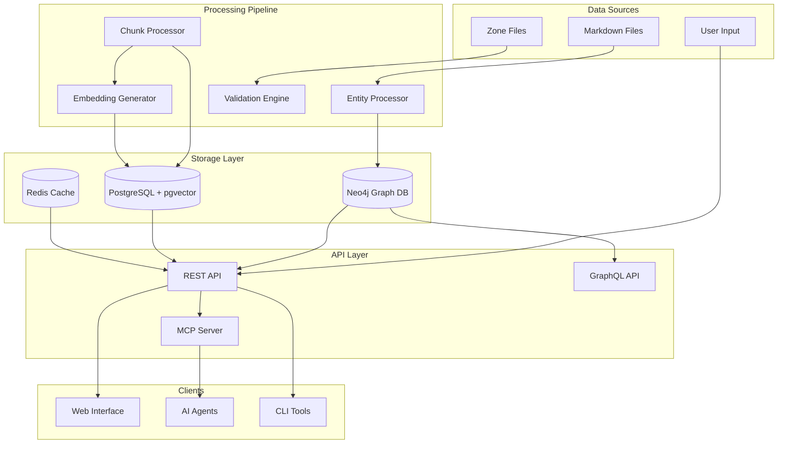
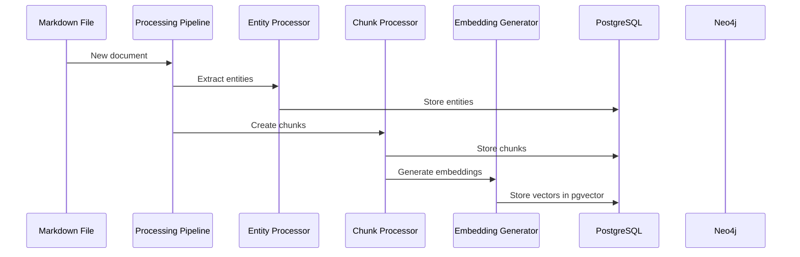
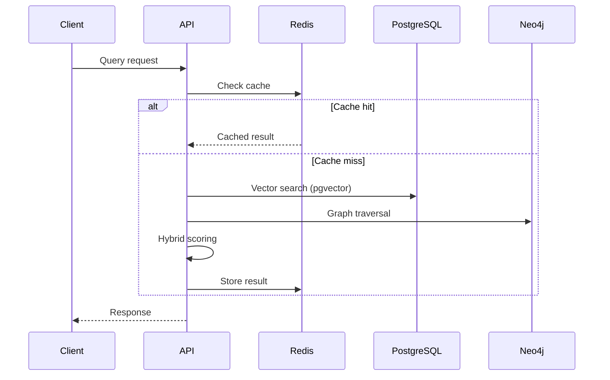
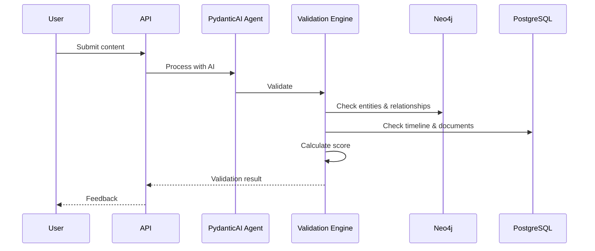

# Luminari Sage Technical Architecture

## System Overview

Luminari Sage employs a hybrid architecture combining Neo4j graph database, PostgreSQL with pgvector for embeddings, and PydanticAI agents to enable intelligent search and validation of game lore. The system leverages Graphiti for knowledge graph management and is designed for scalability, maintainability, and extensibility using fully open-source technologies.



## Core Components

### 1. Data Storage Layer

#### Neo4j Graph Database
**Purpose**: Native graph storage for entities and relationships

**Key Design Decisions**:
- Native graph structure with nodes and relationships
- Property graph model for rich metadata
- Cypher query language for complex traversals
- Built-in graph algorithms for analysis
- Temporal modeling with separate in-world and real-world timelines

**Schema Highlights**:
```cypher
// Core entity nodes
(:Entity {id, stable_id, type, name, attrs})

// Relationship types
[:WORSHIPS|MEMBER_OF|LOCATED_IN|ALLIED_WITH {attrs}]

// Name variants as properties
(:Entity {name, aliases: []})

// Lore connections
(:LoreNode {id, title, body_md, canonical})
(:Entity)-[:MENTIONED_IN]->(:LoreNode)
```

#### PostgreSQL with pgvector
**Purpose**: Document storage, vector embeddings, and full-text search

**Key Design Decisions**:
- pgvector extension for efficient vector similarity search
- JSONB columns for flexible metadata
- Full-text search with tsvector
- Chunk storage with embedded vectors

**Performance Optimizations**:
- Covering indexes on hot paths
- Denormalized JSON for common queries
- Partition strategies for large tables
- Read replicas for scaling

**PostgreSQL Schema with pgvector**:
```sql
-- Enable pgvector extension
CREATE EXTENSION vector;

-- Chunks table with embeddings
CREATE TABLE chunks (
    id SERIAL PRIMARY KEY,
    lore_node_id INTEGER,
    text TEXT,
    embedding vector(384),  -- For MiniLM model
    entities JSONB,
    keywords TEXT[],
    canonical BOOLEAN,
    confidence FLOAT,
    created_at TIMESTAMPTZ
);

-- Create index for vector similarity search
CREATE INDEX ON chunks USING ivfflat (embedding vector_cosine_ops)
WITH (lists = 100);

-- Full-text search index
CREATE INDEX ON chunks USING GIN (to_tsvector('english', text));
```

#### Redis Cache Layer
**Purpose**: Query result caching and session management

**Caching Strategy**:
```python
CACHE_KEYS = {
    'entity': 'entity:{id}',           # TTL: 1 hour
    'search': 'search:{hash}',         # TTL: 15 minutes
    'graph': 'graph:{start}:{depth}',  # TTL: 30 minutes
    'stats': 'stats:{type}',           # TTL: 5 minutes
}
```

#### Graphiti Knowledge Graph Integration
**Purpose**: Manages the knowledge graph construction and updates

**Configuration**:
```python
from graphiti import Graphiti
from pydantic_ai import Agent

graphiti = Graphiti(
    neo4j_uri="bolt://localhost:7687",
    neo4j_auth=("neo4j", "password"),
    llm_client=agent.llm_client,
    embedding_model="sentence-transformers/all-MiniLM-L6-v2"
)
```

### 2. Processing Pipeline

#### Entity Processor with PydanticAI
**Purpose**: Extract and resolve entities using AI agents

**Architecture**:
```python
from pydantic_ai import Agent
from pydantic import BaseModel
from graphiti import Graphiti

class EntityData(BaseModel):
    name: str
    type: str
    aliases: list[str]
    confidence: float

entity_agent = Agent(
    model='gpt-4',  # or local model
    system_prompt="Extract entities from Luminari lore text",
    result_type=list[EntityData]
)

class EntityProcessor:
    def __init__(self):
        self.agent = entity_agent
        self.graphiti = graphiti
        self.confidence_scorer = ConfidenceScorer()
    
    def process_document(self, markdown_text):
        # 1. Extract entities via NER
        raw_entities = self.ner_model.extract(markdown_text)
        
        # 2. Link to existing entities
        linked_entities = self.entity_linker.link(raw_entities)
        
        # 3. Score confidence
        scored_entities = self.confidence_scorer.score(linked_entities)
        
        # 4. Create new entities for unlinked mentions
        new_entities = self.create_new_entities(scored_entities)
        
        return scored_entities + new_entities
```

**Entity Resolution Strategy**:
- Exact match on primary names
- Fuzzy match on aliases (threshold: 0.85)
- Context-based disambiguation
- Confidence scoring (0-100)

#### Chunk Processor
**Purpose**: Split documents into optimal retrieval units

**Chunking Algorithm**:
```python
class ChunkProcessor:
    def __init__(self, config):
        self.target_tokens = config['target_tokens']  # 400
        self.overlap = config['overlap_tokens']       # 50
        self.tokenizer = load_tokenizer()
    
    def chunk_document(self, lore_node):
        chunks = []
        
        # 1. Split by markdown structure
        sections = self.split_by_headers(lore_node.body_md)
        
        for section in sections:
            if self.count_tokens(section) <= self.target_tokens:
                chunks.append(section)
            else:
                # 2. Split large sections by paragraphs
                sub_chunks = self.split_by_paragraphs(
                    section, 
                    self.target_tokens,
                    self.overlap
                )
                chunks.extend(sub_chunks)
        
        # 3. Add context and metadata
        return self.enrich_chunks(chunks, lore_node)
```

#### Embedding Generator
**Purpose**: Generate vector representations of text chunks

**Model Selection**:
```python
EMBEDDING_MODELS = {
    'default': 'sentence-transformers/all-MiniLM-L6-v2',
    'multilingual': 'sentence-transformers/paraphrase-multilingual-MiniLM-L12-v2',
    'large': 'sentence-transformers/all-mpnet-base-v2'
}
```

**Generation Pipeline**:
```python
class EmbeddingGenerator:
    def generate_embeddings(self, chunks):
        embeddings = []
        
        for chunk in chunks:
            # 1. Enhance text with entity context
            enhanced_text = self.enhance_with_entities(chunk)
            
            # 2. Generate embedding
            vector = self.model.encode(enhanced_text)
            
            # 3. Normalize vector
            normalized = vector / np.linalg.norm(vector)
            
            embeddings.append({
                'chunk_id': chunk.id,
                'vector': normalized.tolist(),
                'metadata': self.extract_metadata(chunk)
            })
        
        return embeddings
```

### 3. API Layer

#### REST API Architecture

**Framework**: FastAPI with async support + PydanticAI agents

**Core Structure**:
```python
# src/api/main.py
from fastapi import FastAPI, HTTPException
from typing import List, Optional

app = FastAPI(title="Luminari Sage API", version="1.0.0")

@app.get("/api/v1/entities/{entity_id}")
async def get_entity(entity_id: str, expand_edges: bool = False):
    """Retrieve entity with optional relationship expansion"""
    
@app.post("/api/v1/rag/query")
async def rag_query(query: RAGQuery) -> RAGResponse:
    """Hybrid search combining vectors, graph, and keywords"""
    
@app.post("/api/v1/validation/check")
async def validate_lore(content: LoreContent) -> ValidationResult:
    """Check content for lore consistency"""
```

**Request/Response Models**:
```python
class RAGQuery(BaseModel):
    query: str
    limit: int = 10
    filters: Dict[str, Any] = {}
    include_graph: bool = True
    include_vectors: bool = True

class RAGResponse(BaseModel):
    chunks: List[ChunkResult]
    entities: List[EntityResult]
    confidence: float
    metadata: Dict[str, Any]
```

#### GraphQL Schema

**Schema Definition**:
```graphql
type Query {
  # Entity queries
  entity(id: ID, name: String): Entity
  entities(filter: EntityFilter): [Entity!]!
  
  # Lore queries
  lore(id: ID!): LoreNode
  searchLore(query: String!, limit: Int = 10): [LoreNode!]!
  
  # Graph traversal
  traverse(
    startEntity: ID!
    relationTypes: [String!]
    maxDepth: Int = 2
  ): GraphResult!
  
  # Timeline queries
  timeline(
    startDate: String
    endDate: String
    location: ID
  ): [Event!]!
}

type Mutation {
  # Entity management
  createEntity(input: EntityInput!): Entity!
  updateEntity(id: ID!, input: EntityUpdate!): Entity!
  
  # Relationship management
  createEdge(input: EdgeInput!): Edge!
  deleteEdge(id: ID!): Boolean!
  
  # Content management
  createLoreNode(input: LoreNodeInput!): LoreNode!
  updateLoreNode(id: ID!, input: LoreNodeUpdate!): LoreNode!
}

type Subscription {
  # Real-time updates
  entityUpdated(id: ID!): Entity!
  loreNodeUpdated(id: ID!): LoreNode!
  validationCompleted(jobId: ID!): ValidationResult!
}
```

#### MCP Server Design

**Tool Implementation**:
```typescript
// src/mcp/server.ts
import { MCPServer, Tool } from '@anthropic/mcp';

class LuminariSageMCP extends MCPServer {
  constructor() {
    super({
      name: 'luminari-sage',
      version: '1.0.0',
      description: 'Lore management for LuminariMUD'
    });
    
    this.registerTools();
  }
  
  registerTools() {
    this.addTool(new SearchLoreTool());
    this.addTool(new GetEntityTool());
    this.addTool(new ValidateLoreTool());
    this.addTool(new TraverseGraphTool());
    this.addTool(new ResolveNameTool());
  }
}

class SearchLoreTool extends Tool {
  async execute(params: SearchParams): Promise<SearchResult> {
    // 1. Vector search in PostgreSQL with pgvector
    const vectorResults = await this.pgvectorSearch(params.query);
    
    // 2. Graph traversal in Neo4j
    const graphResults = await this.neo4jSearch(params.query);
    
    // 3. Keyword search in PostgreSQL
    const keywordResults = await this.postgresSearch(params.query);
    
    // 3. Hybrid scoring
    const combined = this.hybridScore(vectorResults, keywordResults);
    
    // 4. Entity enrichment
    return this.enrichWithEntities(combined);
  }
}
```

### 4. Validation Engine

#### Architecture
```python
class ValidationEngine:
    def __init__(self):
        self.rules = self.load_validation_rules()
        self.entity_cache = EntityCache()
        self.timeline_validator = TimelineValidator()
        self.relationship_validator = RelationshipValidator()
    
    def validate_content(self, content: str) -> ValidationResult:
        results = []
        
        # 1. Extract entities from content
        entities = self.extract_entities(content)
        
        # 2. Validate entity references
        for entity in entities:
            if not self.entity_cache.exists(entity):
                results.append(ValidationIssue(
                    type='unknown_entity',
                    severity='warning',
                    message=f'Unknown entity: {entity}',
                    suggestion=self.find_similar(entity)
                ))
        
        # 3. Validate timeline consistency
        timeline_issues = self.timeline_validator.validate(content)
        results.extend(timeline_issues)
        
        # 4. Validate relationships
        relationship_issues = self.relationship_validator.validate(content)
        results.extend(relationship_issues)
        
        # 5. Calculate viability score
        score = self.calculate_score(results)
        
        return ValidationResult(
            issues=results,
            score=score,
            passed=score >= 70
        )
```

#### Validation Rules
```yaml
rules:
  entity_existence:
    severity: warning
    weight: -10
    message: "Entity '{entity}' not found in lore database"
    
  timeline_conflict:
    severity: error
    weight: -20
    message: "Event conflicts with established timeline"
    
  relationship_contradiction:
    severity: warning
    weight: -15
    message: "Relationship contradicts existing lore"
    
  canonical_violation:
    severity: error
    weight: -25
    message: "Contradicts canonical source"
```

## Data Flow Patterns

### 1. Document Ingestion Flow


### 2. Query Processing Flow


### 3. Validation Flow


## Scalability Considerations

### Horizontal Scaling Strategy

#### API Servers
- Stateless design enables easy horizontal scaling
- Load balancer (nginx/ALB) for distribution
- Sticky sessions not required
- Auto-scaling based on CPU/memory metrics

#### Database Scaling
```yaml
Neo4j:
  Cluster:
    - Causal clustering for HA
    - Read replicas for scaling
  Optimization:
    - Index on frequently queried properties
    - Query result caching

PostgreSQL:
  Primary:
    - Write operations
    - Vector insertions
  Read Replicas:
    - Vector similarity searches
    - Full-text searches
  Optimization:
    - Partitioning for time-series data
    - IVFFLAT index tuning for vectors
```

#### pgvector Scaling
```yaml
Pgvector:
  Optimization:
    - IVFFLAT index for large datasets
    - HNSW index for better recall (when available)
    - Partial indexes for filtered searches
  Performance:
    - Connection pooling with pgbouncer
    - Query parallelization
    - Vacuum and analyze scheduling
```

### Performance Optimization

#### Query Optimization
```cypher
-- Neo4j: Optimized entity lookup with relationships
MATCH (e:Entity {stable_id: $stable_id})
OPTIONAL MATCH (e)-[r]->(target:Entity)
RETURN e, 
       collect({
           relation: type(r),
           target_id: target.stable_id,
           target_name: target.name
       }) as edges
```

```sql
-- PostgreSQL: Vector similarity search with filters
SELECT id, text, entities, 
       1 - (embedding <=> $query_vector) as similarity
FROM chunks
WHERE canonical = true
  AND 1 - (embedding <=> $query_vector) > 0.7
ORDER BY embedding <=> $query_vector
LIMIT 10;
```

#### Caching Strategy
```python
class CacheStrategy:
    def __init__(self):
        self.cache_ttl = {
            'entity': 3600,      # 1 hour
            'search': 900,       # 15 minutes
            'validation': 300,   # 5 minutes
            'stats': 60          # 1 minute
        }
    
    def cache_key(self, operation, params):
        # Generate deterministic cache key
        param_hash = hashlib.md5(
            json.dumps(params, sort_keys=True).encode()
        ).hexdigest()
        return f"{operation}:{param_hash}"
    
    def should_cache(self, operation):
        # Don't cache mutations or real-time data
        return operation not in ['create', 'update', 'delete']
```

## Security Architecture

### Authentication & Authorization
```python
class SecurityMiddleware:
    def __init__(self):
        self.jwt_secret = os.environ['JWT_SECRET']
        self.rbac = RoleBasedAccessControl()
    
    async def authenticate(self, request):
        token = request.headers.get('Authorization')
        if not token:
            return None
        
        try:
            payload = jwt.decode(token, self.jwt_secret)
            return User(payload)
        except jwt.InvalidTokenError:
            raise HTTPException(401, "Invalid token")
    
    def authorize(self, user, resource, action):
        return self.rbac.check_permission(
            user.role, 
            resource, 
            action
        )
```

### Data Protection
- Encryption at rest for sensitive data
- TLS for all API communications
- Input validation and sanitization
- SQL injection prevention via parameterized queries
- Rate limiting to prevent abuse

### Audit Logging
```python
class AuditLogger:
    def log_action(self, user, action, resource, details):
        log_entry = {
            'timestamp': datetime.utcnow(),
            'user_id': user.id,
            'action': action,
            'resource': resource,
            'details': details,
            'ip_address': user.ip_address
        }
        
        # Store in audit table
        self.db.audit_log.insert(log_entry)
        
        # Also send to monitoring system
        self.monitoring.send(log_entry)
```

## Monitoring & Observability

### Metrics Collection
```python
METRICS = {
    'api_requests': Counter('api_requests_total'),
    'query_duration': Histogram('query_duration_seconds'),
    'cache_hits': Counter('cache_hits_total'),
    'validation_scores': Histogram('validation_scores'),
    'entity_count': Gauge('entity_count'),
    'chunk_count': Gauge('chunk_count')
}
```

### Health Checks
```python
@app.get("/health")
async def health_check():
    checks = {
        'postgresql': await check_postgresql(),
        'neo4j': await check_neo4j(),
        'redis': await check_redis(),
        'disk_space': check_disk_space(),
        'memory': check_memory()
    }
    
    status = 'healthy' if all(checks.values()) else 'unhealthy'
    return {
        'status': status,
        'checks': checks,
        'timestamp': datetime.utcnow()
    }
```

### Logging Strategy
```yaml
Log Levels:
  ERROR: System failures, data corruption
  WARNING: Performance issues, validation failures
  INFO: API requests, successful operations
  DEBUG: Detailed execution flow

Log Aggregation:
  - Centralized logging (ELK stack or CloudWatch)
  - Structured JSON logs
  - Correlation IDs for request tracing
  - Retention: 30 days hot, 1 year cold storage
```

## Disaster Recovery

### Backup Strategy
```yaml
Neo4j:
  Frequency: Daily full backup
  Retention: 30 days
  Method: neo4j-admin backup
  Storage: S3 with versioning

PostgreSQL:
  Frequency: Daily full, hourly incremental
  Retention: 30 days
  Method: pg_dump + WAL archiving
  Storage: S3 with versioning

Redis:
  Frequency: Hourly RDB snapshots
  Retention: 24 hours
  Method: BGSAVE
  Note: Cache only, can be rebuilt
```

### Recovery Procedures
1. **Database Corruption**: Restore from latest backup, replay WAL logs
2. **Vector Index Loss**: Rebuild pgvector indexes from stored embeddings
3. **Graph Corruption**: Restore Neo4j from backup, rebuild with Graphiti
3. **Cache Loss**: Allow natural repopulation
4. **Complete System Failure**: Multi-region failover

## Development Workflow

### Environment Management
```yaml
Environments:
  Development:
    - Local Docker Compose
    - Sample data subset
    - Mock external services
  
  Staging:
    - Production-like infrastructure
    - Full data copy
    - Integration testing
  
  Production:
    - Multi-AZ deployment
    - Auto-scaling enabled
    - Full monitoring
```

### CI/CD Pipeline
```yaml
Pipeline:
  1. Code Commit:
     - Linting (pylint, eslint)
     - Type checking (mypy, typescript)
  
  2. Build:
     - Docker image creation
     - Dependency resolution
  
  3. Test:
     - Unit tests (pytest, jest)
     - Integration tests
     - Load tests (staging only)
  
  4. Deploy:
     - Blue-green deployment
     - Health check validation
     - Automatic rollback on failure
```

## Technology Stack Summary

### Core Technologies
- **Language**: Python 3.11+ (backend), TypeScript (MCP)
- **Databases**: Neo4j 5.x, PostgreSQL 15+ with pgvector
- **Knowledge Graph**: Graphiti
- **AI Framework**: PydanticAI
- **Cache**: Redis 7.x
- **API Framework**: FastAPI 0.100+
- **GraphQL**: Strawberry GraphQL
- **ORM**: SQLAlchemy 2.0+ (PostgreSQL), py2neo (Neo4j)

### ML/AI Technologies
- **NER**: spaCy 3.x
- **Embeddings**: Sentence Transformers
- **Tokenization**: tiktoken
- **Entity Linking**: Custom implementation

### Infrastructure
- **Container**: Docker 24.x
- **Orchestration**: Kubernetes or Docker Compose
- **Load Balancer**: nginx
- **Monitoring**: Prometheus + Grafana
- **Logging**: ELK Stack or CloudWatch

### Development Tools
- **Version Control**: Git
- **CI/CD**: GitHub Actions / GitLab CI
- **Testing**: pytest, jest, k6
- **Documentation**: Sphinx, OpenAPI

## Performance Benchmarks

### Target Metrics
| Operation | Target | Acceptable | Maximum |
|-----------|--------|------------|---------|
| Entity Lookup | 10ms | 25ms | 50ms |
| Graph Traversal (depth 2) | 50ms | 100ms | 200ms |
| Vector Search (top 10) | 50ms | 100ms | 200ms |
| Hybrid RAG Query | 100ms | 200ms | 500ms |
| Validation Check | 200ms | 500ms | 1000ms |
| Chunk Processing | 100ms/chunk | 200ms/chunk | 500ms/chunk |
| Embedding Generation | 50ms/chunk | 100ms/chunk | 200ms/chunk |

### Capacity Planning
- **Concurrent Users**: 100-1000
- **Queries per Second**: 50-500
- **Data Volume**: 10GB initial, 100GB growth/year
- **Vector Dimensions**: 384 (MiniLM) or 768 (MPNet)
- **Index Size**: ~1GB per million vectors

---

*Document Version: 1.0*
*Last Updated: [Current Date]*
*Status: DRAFT - Technical Review Pending*