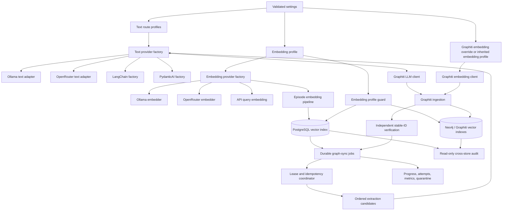
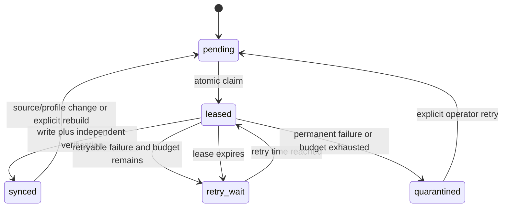

# Ollama and OpenRouter Provider Upgrade Plan

| Field                 | Value                                                                                                  |
| --------------------- | ------------------------------------------------------------------------------------------------------ |
| Status                | Active phased implementation                                                                           |
| Implementation        | Runtime, provider, and embedding-space guard slices implemented; provider/vector activation frozen     |
| Last updated          | 2026-08-07                                                                                             |
| Scope                 | Text generation, embeddings, Graphiti, configuration, storage migrations, deployment, and tests        |
| Compatibility target  | Preserve current Ollama model behavior while adding OpenRouter as an independently selectable provider |
| Supporting workstream | [Local LLM and Graph Pipeline Improvements](./local_llm_graph_pipeline_improvements.md)                |

---

## Implementation checkpoint - 2026-08-07

The first additive Phase 1 checkpoint delivers the provider-neutral reconciliation boundary without changing the active all-Ollama provider path:

- `src/scripts/graph_audit.py` reads PostgreSQL and Neo4j through explicitly read-only clients.
- `src/graphiti/audit.py` produces deterministic human/JSON reconciliation with stable exit codes `0`, `1`, and `2`.
- The audit uses the durable `graph_sync_jobs` state when that migration exists and otherwise labels its lifecycle counts as a legacy Boolean projection.
- Available source, sync-profile, and embedding-profile fingerprints are compared; absent legacy metadata is reported as coverage rather than silently claimed as verified.
- `make graph-audit` and `make graph-audit-json` expose the command.
- Unit coverage exercises clean, drift, and incomplete exits plus missing, unexpected, duplicate, null, source-description, source-fingerprint, profile, invalid-state, orphan-job, and compatibility-projection findings.

Live evidence at this checkpoint: 611 PostgreSQL episodes, 305 synchronized, 306 pending, 305 Neo4j Episodic nodes, 305 populated/distinct stable IDs, and zero audit drift. The focused audit/security suite passed 18 tests; the full fast suite passed 71 tests with 5 skips.

The operator stopped the legacy graph sync worker at this checkpoint and requested that it not continue. Do not restart the Boolean-based worker without explicit operator direction. The durable migrations, leases, attempts, and operator controls are now active; worker integration remains the next ingestion slice, and the audit covers both the compatibility projection and authoritative durable tables.

### Durable migration checkpoint - activated

The first Phase 1 durable-state artifact is implemented and applied to the live schema:

- `schemas/migrations/0001_graph_sync_lifecycle.sql` defines run circuits, authoritative jobs, immutable attempt identities/results/provider calls, lifecycle constraints, deterministic source fingerprints, the derived Boolean compatibility projection, and source-edit requeue behavior.
- `src/scripts/migrate_database.py` discovers ASCII-only numbered migrations, verifies immutable SHA-256 checksums, detects missing or out-of-order history, reports status without mutation, and applies one transaction at a time under an advisory lock.
- Apply mode requires a sanitized verified-backup reference and immutable application revision; the migration ledger retains both with execution time and checksum.
- Before activation, the complete SQL seeded and reconciled all 611 current episodes in a live-schema transaction and then rolled back. A separate isolated-schema integration test proved projection guards, ledger immutability, one active run, source-fingerprint parity, durable success, and automatic requeue after a source edit.
- Migration/security/audit focused verification passed 34 tests, and the PostgreSQL migration integration test passed independently.

Migration `0001_graph_sync_lifecycle` was applied on `2026-08-06T22:24:51Z` under its advisory lock. The immutable ledger records checksum `ffec679f11f6743448be781b342c09e4bcd77308405e520e978e96ad241e9671`, verified backup `backups/provider-upgrade-20260806T222200Z`, application revision `a831a497c3499155bb450d80dc96093740e4fbe4`, and 18 ms execution time. Both status and check modes report current with no pending migration.

The seed created exactly 611 durable jobs: 305 `synced` and 306 `pending`. All 611 desired source fingerprints match current episode text; all 305 synchronized jobs have matching verified source/profile identity and timestamps. There are no runs, attempts, results, provider calls, active leases, retry-wait jobs, or quarantined jobs. The derived Boolean projection has zero mismatches. Required triggers and claim/lease indexes are present.

The post-migration graph audit now reports `graph_sync_jobs` as its authoritative state source, 611 job source/profile fingerprints, 305 verified source fingerprints, 305 distinct Neo4j stable IDs, and zero drift findings. All services remain healthy and the legacy worker remains stopped.

### Durable runtime checkpoint - activated

The next Phase 1 artifact is implemented and tested without starting ingestion:

- `schemas/migrations/0002_graph_sync_runtime.sql` adds retry-generation budgets, run heartbeats, captured job/provider limits and delays, a serialized database provider-call ceiling, terminal-result ledger guards, and source-revision budget reset while preserving total attempt history.
- `src/graphiti/sync_models.py` defines validated policies, leases, failure taxonomy/dispositions, provider-call provenance, stable-ID verification, graph counts, bounded deterministic backoff, and mandatory secret redaction at construction boundaries.
- `src/graphiti/sync_state.py` implements one-active-run coordination, readiness-gated circuit resume, atomic `FOR UPDATE SKIP LOCKED` claims, database-time expiring leases, token fencing, immutable attempt/provider records, verified success, classified retry/quarantine, systemic pause without charging the generation budget, expired-lease recovery, and atomic operator retries.
- `src/scripts/graph_sync.py` plus Make targets expose read-only status/list/attempt-chain inspection, expired-lease recovery, eligible retry, explicit confirmation-gated quarantine retry, and run drain/resume/stop controls. No command performs ingestion.
- Isolated PostgreSQL coverage proves distinct concurrent claims, provider/result ledger guards, upgrade backfill across the existing append-only trigger, source-edit fencing, expired-worker fencing, retry history preservation, systemic pause/readiness, redaction, and all-or-nothing operator batches.

Focused verification passes 27 unit tests and 9 isolated PostgreSQL integration tests; the full fast suite passes 103 tests with 6 skips and 108 intentionally deselected tests. A live-schema rehearsal executed the complete `0002` SQL against all 611 current jobs inside one explicit transaction, verified zero invalid jobs and both new ledger guards, and rolled back unconditionally. Post-rollback proof showed no runtime column/function, one unchanged migration-ledger row, and all 611 jobs intact. The graph audit remains clean at 305 synchronized records and 305 distinct Neo4j stable IDs, and every service is healthy.

Migration `0002_graph_sync_runtime` was applied on `2026-08-06T22:57:38Z`. The immutable ledger records checksum `773cbdfdfbf01a87e2a39c1a46bca6a1f07b124e9951451db078c8c6890f3cec`, verified backup `backups/provider-upgrade-20260806T222200Z`, application revision `4429d33bf4164a9e4b6b477b5e5c634a790a560a`, and 8 ms execution time. Status and check modes report current with two applied migrations and no pending SQL.

Activation preserved all live state: 611 jobs remain 305 `synced` and 306 `pending`, with zero runs, attempts, results, provider calls, leases, retry-wait rows, quarantines, nonzero runtime counters, and compatibility-projection mismatches. Required provider/result/append-only/source triggers are present; operator status and list commands return the expected empty runtime ledger; the graph audit remains clean; and all services are healthy. Applying the migration did not start ingestion. The legacy Boolean worker remains stopped by operator request; worker integration and fault-injection around Neo4j crash windows remain required before any ingestion is authorized.

### Provider-call reservation checkpoint - activated

Migration `0003_graph_sync_provider_call_intents` closes the request-dispatch crash window before durable worker integration:

- Every allowed provider request receives an immutable intent containing attempt, call number, logical/transport attempt, provider, model/revision, candidate, prompt/schema versions, and start time before network I/O.
- The hard database budget counts intents rather than only returned calls. Completion is a separate append-only record that must match the reserved identity, and terminal success is rejected while any intent is incomplete.
- Attempt recovery counts all reservations. A crash after dispatch but before completion therefore remains visible in the sanitized attempt chain and cannot produce false success or silently restore budget.
- Repository APIs separately reserve and complete provider calls under the current token-fenced lease; status reports reserved and completed totals independently.
- Upgrade tests backfill pre-existing completed calls, while isolated fault coverage proves hard limits, terminal guards, immutable intent/result rows, and recovery of an incomplete reservation.

Focused verification passes 27 unit tests and 10 isolated PostgreSQL integration tests; the full fast suite passes 103 tests with 6 skips and 109 intentionally deselected tests. The complete migration also passed a rollback-only rehearsal against the live schema: the intent table and guards existed inside the transaction with zero rows, then rollback restored two migration-ledger rows, no intent artifacts, and all 611 jobs.

Migration `0003_graph_sync_provider_call_intents` was applied on `2026-08-06T23:11:09Z`. The immutable ledger records checksum `d784d783f49cf16bf1a3ee51f8eeb074bc93e12ffd8310c204438ade41829bc6`, verified backup `backups/provider-upgrade-20260806T222200Z`, application revision `03b39f85eca202a9f314244e00b078e0bbd96a53`, and 6 ms execution time. Status and check modes report current with three applied migrations and no pending SQL.

Activation produced zero intents, completions, attempts, runs, leases, or compatibility-projection mismatches. Required intent append-only, request-limit, and completion-matching triggers are present; operator status reports zero reserved and completed calls; the graph audit remains clean at 305 synchronized records and 305 distinct stable IDs; and all services are healthy. No provider request or ingestion was started, and the legacy worker remains stopped by operator request.

### Durable worker integration checkpoint - implemented, not activated

The legacy Boolean queue has been removed from `src/scripts/sync_episodes_to_graphiti.py`. The replacement is inert unless `--run` and the exact `RUN_DURABLE_GRAPH_SYNC` confirmation are both supplied; legacy bulk flags fail before any database connection. The Make targets enforce the same confirmation and use a fresh one-off container. The operator freeze remains in force, so this checkpoint did not claim or ingest any live job.

- `src/graphiti/sync_profile.py` hashes the Graphiti implementation, prompt/schema versions, entity and edge contracts, normalization version, candidate route, embedding profile, and extraction limits into deterministic secret-free fingerprints. An explicitly configured fingerprint is a drift guard and must match the resolved contract.
- `src/graphiti/provider_tracking.py` wraps the actual OpenAI-compatible `chat.completions.create` boundary. It commits an intent before network I/O, records sanitized completion/usage afterward, restores the client method on every exit path, and refuses clients with opaque transport retries. Ollama and direct OpenAI Graphiti transports now use `max_retries=0`; Graphiti-level retries remain visible as separately reserved requests under the database ceiling.
- `src/graphiti/sync_graph.py` uses the PostgreSQL episode UUID as Graphiti's native UUID, detects candidates through native UUID/stable ID/source description, compares source content without logging it, safely adopts one compatible legacy node, stamps source/sync/embedding provenance, and independently requeries every required field before PostgreSQL success.
- `src/graphiti/sync_worker.py` performs graph/provider and read-only target-profile checks before opening a run, refuses non-synced jobs assigned to another profile, recovers expired leases, claims one job at a time, heartbeats the run and lease, records verified success or classified failure, pauses on systemic failures, and cancels/requeues an active attempt on graceful shutdown.
- The operator CLI now serializes typed run records correctly. The isolated PostgreSQL fixture refuses to start unless all three migrations and all seven test tables are present in its generated schema, then rechecks its active `search_path` and row counts before yielding.

Fault-injection coverage proves convergence without a second graph write for process death after the Neo4j write, before post-write verification, and after verification but before PostgreSQL success; a fault before the write retries without a false node. Additional tests cover legacy-node adoption, conflicting-content refusal, reserve-before-network ordering, failed-call completion, pre-network budget rejection, retry disabling, profile drift, heartbeat cleanup, systemic pause, and graceful shutdown. The full fast gate passes 127 tests with 6 skips and 109 intentionally deselected tests. Eight isolated PostgreSQL lifecycle tests and the provider tracking suite pass in a fresh container.

Read-only validation against the stopped live data proved the new Neo4j inspection query returns exactly one legacy candidate with matching stable ID, source description, and content; expected legacy fingerprint/profile coverage remains zero. Neo4j accepted the metadata-write query under `EXPLAIN`. `graph-audit` remains clean at 611 jobs, 305 synchronized records, and 305 distinct stable IDs; migration check remains current; every service is healthy; and no worker process exists.

One initial integration command used the older long-running API container, which did not have the later `/app/schemas` mount. The test fixture therefore found the public durable tables after creating its isolated `episodes` table and opened one empty run-circuit row. It claimed zero jobs and created zero attempts, requests, or results. The run was immediately moved to `stopped`; the isolation guards above now make this failure mode impossible, and the suite was rerun successfully in a fresh container. The append-only operational history intentionally retains that one stopped, zero-attempt run.

### Backup and activation safety checkpoint - verified

The recoverability tooling and live pre-migration checkpoint are complete:

- `make backup-provider-upgrade` creates a private combined backup set below ignored `backups/` storage.
- PostgreSQL is dumped in custom format, restored into a generated scratch database, checked for episode/table counts, and removed after verification.
- Neo4j Community Edition is stopped before dumping both `neo4j` and `system`; each archive is inspected and consistency-checked before the service is restarted and health-gated.
- `src/scripts/verify_provider_upgrade_backup.py` binds the completion marker to all three SHA-256 digests and rejects escaped paths, symlinks, altered dumps, broad permissions, or incomplete restore evidence.
- `make db-migrate` now independently repeats that verification before invoking the immutable migration runner.
- `docs/deployment/PROVIDER_UPGRADE_BACKUP_RESTORE.md` records the tested backup contract and explicit PostgreSQL/Neo4j recovery commands.

Focused backup-verifier coverage passes 5 tests; Bash syntax, ShellCheck, Compose rendering, Make dry-runs, and path/confirmation refusal checks pass. The legacy worker remains stopped and no backup command starts it.

The first live backup attempt safely stopped at the Neo4j dump step because the image's login-shell `PATH` does not include `neo4j-admin`. The exit trap removed the exact temporary dump directory, restarted Neo4j to healthy, left no completion marker, and did not start the worker. The tooling now invokes `/var/lib/neo4j/bin/neo4j-admin` explicitly; the incomplete reference is not eligible for migration.

The replacement backup `backups/provider-upgrade-20260806T222200Z`, created at `2026-08-06T22:22:47Z`, passed every gate:

- PostgreSQL dump: 2,691,434 bytes, SHA-256 `42a1a24acdf706784d725f115d74b72f11e00373ae2c8e5160944f416e6065c3`; the scratch restore contained 611 episodes, 305 synchronized episodes, and 12 public tables.
- Neo4j graph dump: 12,574,109 bytes, SHA-256 `1b7fd875d72d7cb89320971edfcd23a3b963aa5f8f0182b9565498a1dd30c548`; archive inspection and full consistency check passed.
- Neo4j system dump: 19,495 bytes, SHA-256 `a44f6dad8d7c6d8a5a31673c2f120bd9260286b698d93b5beccf034dec3c775d`; archive inspection and full consistency check passed.
- The independent verifier accepted the private `0600` artifacts and `0700` directory; no scratch database or temporary Neo4j dump directory remained.
- PostgreSQL, Neo4j, Ollama, API, and UI returned healthy. The post-backup graph audit remained clean at 611 total, 305 synchronized, 306 pending, and 305 distinct Neo4j stable IDs.
- The legacy worker remained stopped throughout.

The additive migration consumed this backup gate and is verified current. Retain the backup through the rollout and rollback bake period.

### Provider-neutral configuration and adapter checkpoint - implemented offline

The first non-activating slices from Phases 2, 4, 5, and 6 are implemented. They change configuration and construction paths only; they do not select OpenRouter models, migrate a vector space, claim a graph job, or make a provider request.

- Added immutable provider connections, task candidates/routes, embedding profiles, graph policy settings, selector precedence, selected-provider validation, secret-free fingerprints, and profile-aware caches. Direct OpenAI remains a compatibility-only provider and is never reinterpreted as OpenRouter.
- Added `OPENROUTER_API_KEY` and file-backed secret support plus a one-window `OPENROUTER_KEY` compatibility alias. The alias emits a warning without logging its value. OpenRouter defaults disable provider fallback, require parameter support, deny data collection, and leave ZDR opt-in pending the Phase 0 privacy decision.
- Added OpenRouter Chat Completions, streaming, tool/response-format, usage, returned-model/upstream, and in-band stream-error handling through the existing OpenAI SDK. LangChain and PydanticAI now construct from the same validated candidates, and legacy agent constructors can use Ollama or OpenRouter without a direct OpenAI key.
- Split text and embedding construction. OpenRouter embeddings use batch input, explicit float encoding, dimensions, response-index ordering, usage capture, and strict vector validation. Ollama now uses the batch-capable `/api/embed` endpoint and the same cardinality, dimension, finite-value, and non-zero-norm contract.
- Replaced Graphiti's coupled provider builder with independent text and embedding profiles while retaining `ollama_config.py` as a deprecation shim. Offline construction tests cover Ollama/Ollama, Ollama/OpenRouter, OpenRouter/Ollama, and OpenRouter/OpenRouter.
- Added sanitized provider/model/fingerprint/dimension startup and health output, expanded the public environment contract, and added OpenRouter secret-file loading to the container entrypoint. The user's `OPENROUTER_KEY` remains only in ignored local configuration and was never printed.

The complete offline fast suite passes 185 tests with 6 skips and 109 intentionally deselected tests. Ruff formatting/linting, Python compilation, ShellCheck, Compose validation, environment/secret contract tests, and `git diff --check` pass. No OpenRouter or Ollama inference request was made, and the graph worker remains stopped.

Still open before activation: explicit OpenRouter model selection and capability verification, the privacy/ZDR decision, integration of the executable route into Graphiti and framework call sites, live structured-output and streaming tests, embedding shadow/index migration, conditional Ollama service dependencies, and any graph profile transition or ingest authorization.

### Bounded retry, route, and deployment checkpoint - implemented offline

The next non-activating slices from Phases 2, 4, 5, and 8 are implemented without selecting a billed model or running ingestion:

- Added stable provider-failure classification and finite, bounded transport policy. Direct OpenRouter text and embedding requests disable OpenAI SDK retries, retry only configured pre-response failure classes, respect both `Retry-After` forms, and cap exponential backoff. In-band stream failures are never replayed after partial output.
- Added a provider-neutral text-route executor above single-call adapters. It owns actual transport-call accounting, separates transport retries from same-candidate model retries and candidate fallback, enforces the declared request ceiling, rejects authentication/configuration fallback, and returns a prompt-free attempt chain. Successful fallback is explicitly marked degraded.
- Added mocked coverage for non-streaming and streaming creation, usage, routing, bounded rate-limit/timeout retries, mid-stream errors, untrusted-error redaction, schema retry, ordered fallback, authentication refusal, deterministic embedding ordering, invalid vectors, and same-profile embedding retry with no cross-model fallback.
- Split production cloud credentials into `docker-compose.openai.yml` and `docker-compose.openrouter.yml`. The base production Compose file mounts neither key; the remote deploy selects overrides from the effective application, embedding, Graphiti, and fallback providers, removes stale unused cloud-key files, and requires an explicit external Ollama URL when production selects Ollama.
- Extended the manual deployment workflow with conditional provider/model validation and optional OpenRouter secret transport. NUL-delimited deployment inputs remain shell-local rather than being exported to child processes, and only selected provider secrets are written as owner-only files.

The full offline fast gate passes 203 tests with 6 skips and 109 intentionally deselected tests. A separate production Compose matrix renders all-Ollama, direct-OpenAI, OpenRouter, and mixed OpenRouter/OpenAI profiles. Bash syntax, ShellCheck, Actionlint, Black, isort, Ruff, secret-file permissions, child-environment isolation, and diff checks pass. No provider request, graph claim, or ingestion occurred.

The route executor is currently available to direct application call sites but is not yet wired into Graphiti, LangChain, or PydanticAI execution. Those framework SDK clients retain `max_retries=0`; Graphiti retains its existing durable request reservation and explicit internal-attempt accounting. Therefore Phase 3 extraction fallback remains unchecked and no live fallback behavior is claimed. The local `OPENROUTER_KEY` alias was recognized without printing or committing its value, and the worker remains stopped by operator request.

### Capability-derived Ollama model lifecycle checkpoint - implemented offline

The next non-activating Phase 8 slice makes local model preparation follow the resolved capability profile instead of a hard-coded all-Ollama model list:

- Added one POSIX-shell resolver for application text tasks, application embeddings, independent Graphiti text and embeddings, and the optional Graphiti extraction fallback. It validates provider/model labels, applies legacy selector precedence, and deduplicates the resulting text and embedding models.
- Updated `ollama-init` and the setup script to pull only models used by an Ollama capability. An all-cloud profile exits before requiring the Ollama CLI or starting the setup dependency; a mixed profile includes only its selected local models.
- Updated warmup to use the same model list, send text warmups through `ollama run`, and send embedding warmups through Ollama's `/api/embed` endpoint.
- Kept cloud keys and passwords out of the init service. Compose now forwards empty raw capability selectors so the shared application resolver, rather than Compose interpolation, remains authoritative for legacy precedence.
- Added ten offline lifecycle tests covering all-Ollama, all-OpenRouter, mixed, task override, deduplication, invalid configuration, fake pull dispatch, and Compose/script contracts.

The complete offline fast suite passes 213 tests with 6 skips and 109 intentionally deselected tests. Bash syntax, ShellCheck, Compose validation, formatting/linting, and a read-only Compose `list` invocation pass. That invocation resolved `qwen2.5:7b`, `qwen2.5:3b`, and `nomic-embed-text` for the current local profile; it did not pull or warm a model. No provider request, graph claim, or ingestion occurred, and the operator-requested worker freeze remains active.

This checkpoint makes model pulls and warmups conditional, but it does not yet make the base API/Ollama service dependency graph conditional. Phase 8's exit criterion that each deployment start only required services therefore remains open.

### Guarded provider operations checkpoint - implemented offline

The provider-neutral operations slice now exposes safe configuration inspection and bounded opt-in probes without activating any provider during implementation:

- Added a provider configuration command with human and stable JSON output. It resolves the complete application and Graphiti profiles, reports only sanitized models/fingerprints/policies and Boolean selected-credential status, and makes no provider request.
- Added application text-task and application/Graphiti embedding probes. Each uses a fixed non-user input, the selected primary model/profile, exactly one transport attempt, no candidate fallback, and shared embedding dimension/finite/non-zero validation.
- Added independent exact `RUN_PROVIDER_PROBE` confirmation checks in both the Make targets and Python command. Probe confirmation is checked before provider configuration is resolved or a client is constructed.
- Probe output omits prompts, generated text, vector values, credentials, and exception detail; failures expose only the classified failure class and stable code.
- Added eight offline tests for the deprecated OpenRouter-key alias's Boolean credential status, pre-resolution refusal, one-call text behavior, zero-retry cloud embeddings, vector validation, failure redaction, and non-probing configuration checks.

The complete offline fast suite passes 221 tests with 6 skips and 109 intentionally deselected tests. The real configuration-check target validated the current all-Ollama application and Graphiti profile. Both Make probe targets were invoked without confirmation and refused before their Docker/provider command; no confirmed probe was run. No provider request, graph claim, or ingestion occurred, and the operator-requested worker freeze remains active.

The existing Graphiti benchmark remains provider-coupled and mutates legacy synchronization state, so it is not accepted as the provider-neutral benchmark required by Phase 8. The combined Make-target checklist item remains open until that benchmark is replaced with a versioned, durable-lifecycle-safe harness.

### Non-persistent Graphiti extraction benchmark checkpoint - implemented offline

The unsafe legacy benchmark has been replaced without running a model or touching synchronization state:

- Added a checked-in, byte-fingerprinted `luminari-graphiti-extraction:v1` corpus with three synthetic entity/relationship cases and explicit micro-recall thresholds.
- Added a provider-neutral harness around Graphiti's combined in-memory entity/edge extractor. It constructs no PostgreSQL, Neo4j, or embedding client and never writes an episode, graph node, edge, or synchronization flag.
- The harness can benchmark the selected primary, declared fallback, or both route candidates. Concurrency is capped at two and defaults to one; every candidate/case pair has a hard actual transport-call ceiling that cannot exceed the route budget, while SDK retries remain disabled.
- Actual calls, recovered provider failures, budget rejections, token usage, returned models, and upstream providers are recorded without emitting corpus text, prompts, responses, facts, vectors, credentials, or exception detail. A recovered provider failure marks the case degraded and fails the benchmark gate.
- Added the independent exact `RUN_GRAPHITI_BENCHMARK` confirmation at the Make boundary and Python boundary before corpus loading, credential resolution, or client construction. The former provider-specific OpenAI target and legacy state-mutating shell path now refuse execution.
- Added operator documentation and packaged the fixed corpus read-only in development Compose and the application image.

Eleven new offline benchmark tests cover corpus integrity, referential validation, content-free scoring, request accounting, pre-network budget refusal, degraded retries, bounded concurrency, candidate comparison, no-confirmation refusal, trackable client construction, and the inert legacy path. The complete offline fast suite passes 232 tests with 6 skips and 109 intentionally deselected tests. Only refusal and Make dry-run paths were exercised; the confirmed benchmark was not run. No provider request, graph claim, database mutation, or ingestion occurred, and the worker remains stopped by operator request.

This checkpoint provides the versioned harness and summary schema, but it does not supply a selected-model quality result. Phase 6's live structured-extraction verification and benchmark-result record remain open until the operator explicitly authorizes a provider run.

### Durable graph-sync run observability checkpoint - implemented read-only

The remaining Phase 1 aggregate-observability contract is now implemented without activating ingestion:

- Added a stable run-summary schema derived from current profile job state plus the immutable run, attempt, request-intent, and provider-call ledgers.
- Reports separate job states, attempt outcomes, attempt/provider failure classes, reserved versus completed calls, graph-count coverage, and usage coverage. Missing graph/token telemetry remains `null` with explicit coverage counts rather than being misreported as zero.
- Added completion percentage, configurable rolling verified episodes per minute, and an explicitly approximate ETA with stable unavailable reasons for warming, stopped, paused, quarantined, or insufficient-progress states.
- Every summary is read through one repeatable-read, read-only PostgreSQL transaction. Human and JSON renderers omit episode IDs/text, prompts, responses, vectors, credentials, model output, and arbitrary exception representations.
- Added read-only CLI and Make entrypoints for the latest or an explicitly selected run, embedded the overview in normal graph-sync status, and attached the durable terminal summary to future explicitly authorized worker output.
- Changed the older worker `--status` compatibility path to create a read-only PostgreSQL client instead of the normal schema-initializing connection.

Thirty-one focused offline unit/CLI tests pass. The complete fast suite passes 249 tests with 6 skips and 110 intentional deselections, and all 11 isolated graph-sync lifecycle/migration integration tests pass. The real read-only command reports the stopped 611-job snapshot at 305 synchronized and 306 pending, with no leases, retries, quarantines, durable attempts, or provider calls. It correctly reports the retained zero-attempt run as stopped with no ETA. The command made no mutation, no graph job was claimed, no model/provider request occurred, and the operator-requested worker freeze remains active.

### Provider environment and secret-scanner checkpoint - implemented offline

The remaining Phase 8 environment/scanner contract is now implemented without activating any provider:

- `PROVIDER_ENVIRONMENT_FIELDS` is the enforced source of truth for selectors, credentials, task-specific model/capability settings, retries, routing policy, embeddings, Graphiti overrides, and durable graph policy settings. Resolver code cannot silently read an undeclared field.
- `.env.example` now documents every accepted provider field. Direct credentials and credential-file paths remain empty, the copied default resolves as Ollama/Ollama for both application and Graphiti, and the deprecated `OPENROUTER_KEY` remains an explicit one-window alias rather than an ambiguous secret-file input.
- Fixed the empty Graphiti fallback selector: its inline comment was previously parsed by `python-dotenv` as a nonempty provider name.
- Gitleaks now has an explicit OpenRouter signature rule. Unit tests validate its match boundary, and the security workflow generates a synthetic key and requires the pinned scanner to detect it with full redaction before the full-history scan.

Thirty focused configuration/scanner tests pass. The complete network-isolated fast suite passes 254 tests with 6 skips and 110 intentional deselections; Ruff, Black, isort, Actionlint, the synthetic scanner test, and a 28-commit redacted history scan also pass. The real ignored `.env` was not displayed or staged. No provider/model request, graph claim, ingestion, or live data mutation occurred, and the worker remains stopped by operator request.

### Embedding profile and physical-index guard checkpoint - implemented, not activated

The first Phase 5/7 storage boundary is implemented without changing the live
vector space or calling an embedding provider:

- Added migration `0004_embedding_index_profiles`. It requires the existing
  episode column to be exactly `vector(768)`, builds a replacement episode HNSW
  cosine index, creates immutable secret-free `embedding_profiles`, and
  creates authoritative `embedding_index_states` with at most one active physical
  space per semantic index.
- Corrected the checked-in base schema to 768-dimensional episode vectors and
  retired the destructive 1536-dimensional `add_episode_uuid.sql` helper. The
  384-dimensional chunk and search-query spaces remain physically intact but are
  recorded as retired application paths.
- Added read-only human/JSON preflight over configured/stored fingerprints,
  sanitized profile components, vector typmods, index method/operator/options,
  validity/readiness, and aggregate total/embedded row counts. It reads neither
  source text nor vector values.
- Added an explicit metadata-only activation command. Empty spaces and populated
  spaces require different exact tokens; adopting existing vectors is an operator
  provenance attestation and cannot be inferred from dimensions.
- API startup keeps embedding-dependent endpoints unavailable until preflight is
  ready. `/api/v1/rag/query`, `/api/v1/validate`, and episode embedding generation
  repeat the guard before any provider request; a stale loaded adapter is also
  rejected.
- Moved `/api/v1/validate` from the legacy 384-dimensional chunk query to the
  supported episode index, eliminating its implicit cross-space embedder reuse.

Twenty-five focused offline tests pass. All 13 relevant rollback-only PostgreSQL
tests pass together, covering upgrade and fresh-schema DDL, physical index shape,
explicit adoption, profile immutability, mismatches, and the existing durable graph
fixtures. The complete fast suite passes 264 tests with 6 skips and 112 intentional
deselections.

The live preflight was strictly read-only and returned the expected blocked state:
611/611 episode vectors at 768 dimensions, no episode vector index, no profile/state
tables, and empty indexed 384-dimensional chunk/search-query spaces. Migration
`0004` is pending and was not applied; no profile was adopted and no live index was
created. The ignored `.env` was not inspected or displayed; the new local
`OPENROUTER_KEY` was not logged or used for a provider request. No provider/model
call, graph claim, ingestion, or live data mutation occurred, and the worker remains
stopped by operator request.

---

## 1. Executive Summary

Luminari Sage currently treats the text-generation provider, embedding provider, and Graphiti provider as partially overlapping configuration choices. That works for the current all-Ollama deployment, but it does not safely support combinations such as:

1. Ollama text models with OpenRouter embeddings.
2. OpenRouter text models with Ollama embeddings.
3. Ollama for both capabilities.
4. OpenRouter for both capabilities.

The upgrade should separate provider selection by capability, centralize provider and model configuration, and make the identity of every embedding vector space explicit. Interactive text routes can usually switch through configuration because they do not define a shared vector space. Graphiti extraction routes are different: their outputs shape persisted graph data, so route/prompt/schema changes require versioned provenance, quality comparison, and sometimes a rebuild. Embedding models always require a controlled migration because vectors from different models, revisions, dimensions, encodings, or inference implementations are not interchangeable.

The first delivery should keep Ollama as the default and preserve model-selection and user-visible output behavior for an unchanged environment. It deliberately improves synchronization state and failure visibility before changing providers. OpenRouter support should then be added incrementally through its OpenAI-compatible Chat Completions and Embeddings APIs. Graphiti must receive separate text and embedding clients so it can use any supported combination.

The implementation must never silently fall back from one embedding model to another. A mismatch between configured embedding metadata and a stored index must fail closed before search or ingestion can mix vector spaces.

Provider flexibility alone will not make the graph pipeline reliable. The full local import exposed malformed structured output, exhausted retries, limited failure history, manual cross-store reconciliation, weak progress reporting, and graph-quality variance. Those findings are now part of this program's required operational foundation, not a later optimization backlog.

This document is the umbrella source of truth for architecture, sequencing, cross-provider contracts, release gates, and the definition of done. The [local pipeline workstream](./local_llm_graph_pipeline_improvements.md) remains the evidence log and detailed design for Ollama-specific extraction, GPU, throughput, and local release behavior. If the documents conflict, this umbrella plan governs and both documents must be reconciled in the same documentation change.

---

## 2. Goals

- [ ] Support `ollama` and `openrouter` as first-class text-generation providers.
- [ ] Support `ollama` and `openrouter` as first-class embedding providers.
- [ ] Allow text and embedding providers to be selected independently.
- [ ] Allow the Graphiti extraction route and embedding profile to inherit application defaults or override them independently.
- [ ] Preserve task-specific text models for chat, creative writing, reasoning, extraction, and tool calling.
- [ ] Use one validated configuration source across direct providers, LangChain, PydanticAI, Graphiti, API startup, scripts, and tests.
- [ ] Make embedding model, dimensions, encoding, distance metric, and implementation identity explicit.
- [ ] Prevent queries from being executed against an incompatible vector index.
- [ ] Provide a repeatable, reversible vector and graph migration workflow.
- [ ] Add provider-aware health information, metrics, error handling, and secret transport.
- [ ] Preserve the current local-only mode with no OpenRouter credential requirement.
- [ ] Add a durable, leased, idempotent Graphiti ingestion lifecycle with attempt history, bounded retries, and quarantine.
- [ ] Distinguish transport retries, same-candidate generation retries, intentional text-model fallback, and durable job retries in configuration, telemetry, and tests.
- [x] Add a read-only PostgreSQL/Neo4j reconciliation command with actionable exit codes and machine-readable output.
- [ ] Measure graph completeness and graph quality independently.
- [ ] Add repeatable local and provider-matrix release gates, including browser streaming and preserved-volume checks.

## 3. Non-Goals

- Adding first-class providers beyond Ollama and OpenRouter in the first release. Existing direct-OpenAI support is a separate compatibility decision, not a third target architecture.
- Dynamically selecting a different embedding model per request.
- Mixing vectors from different embedding profiles in one active index.
- Automatically falling back to a different embedding model during an outage.
- Providing exactly-once distributed transactions across PostgreSQL and Neo4j. The design uses idempotent at-least-once processing plus reconciliation.
- Enabling unbounded or implicit text-model failover. Any text fallback must be an explicit, ordered route with a bounded attempt budget.
- Adopting binary-vector or Hamming-distance storage in the first release.
- Replacing PostgreSQL/pgvector, Neo4j, Graphiti, LangChain, or PydanticAI.
- Choosing permanent OpenRouter text-model slugs as part of the provider abstraction. Model selection remains deployment configuration and must pass the capability tests in this plan.

---

## 4. Current-State Findings

### 4.1 Provider coupling

| Area                    | Current behavior                                                                                  | Upgrade risk                                                                             |
| ----------------------- | ------------------------------------------------------------------------------------------------- | ---------------------------------------------------------------------------------------- |
| Core text configuration | `LLM_PROVIDER` selects Ollama or OpenAI and also carries an embedding model                       | Text and embedding choices cannot be reasoned about independently                        |
| Embedding factory       | `USE_LOCAL_EMBEDDINGS` and `LLM_PROVIDER` jointly select Ollama, OpenAI, or sentence-transformers | OpenRouter cannot be selected without impersonating OpenAI; dimensions are hard-coded    |
| Core provider interface | `BaseLLMProvider` includes `embed()` even though a separate `BaseEmbedder` exists                 | Capability boundaries are duplicated and can drift                                       |
| Graphiti                | `GRAPHITI_PROVIDER` selects both the LLM client and embedding client                              | Graphiti cannot use local extraction with cloud embeddings, or the reverse               |
| LangChain               | Factory branches only between `ChatOllama` and direct `ChatOpenAI`                                | OpenRouter base URL, credential, headers, routing, and errors are not represented        |
| PydanticAI              | `create_openai_chat_model()` accepts only an OpenAI API key                                       | Legacy agents are tied to OpenAI-specific construction rather than the active text route |
| Prompt selection        | All non-Ollama providers receive the OpenAI prompt path                                           | An OpenRouter-hosted Qwen, Claude, Gemini, or other model is treated as an OpenAI model  |
| Deployment secrets      | Secret-file loading covers `OPENAI_API_KEY`, not `OPENROUTER_API_KEY`                             | OpenRouter cannot be deployed with the existing file-secret workflow                     |
| Tests                   | Provider enums and vector lengths are fixed to Ollama/OpenAI and 768/1536                         | The test suite will reject new valid combinations and miss cross-profile mistakes        |

Relevant files include:

- [`src/llm/config.py`](../../src/llm/config.py)
- [`src/llm/base.py`](../../src/llm/base.py)
- [`src/llm/langchain_helpers.py`](../../src/llm/langchain_helpers.py)
- [`src/llm/pydantic_ai_factory.py`](../../src/llm/pydantic_ai_factory.py)
- [`src/graphiti/ollama_config.py`](../../src/graphiti/ollama_config.py)
- [`src/llm/embeddings/factory.py`](../../src/llm/embeddings/factory.py)

### 4.2 Vector-schema drift

At the initial inventory, the vector schema was not represented by one authoritative source:

- The checked-in base schema declared `episodes.embedding` as `vector(384)`; v0.7.17
  corrects it to the supported `vector(768)` shape.
- The old `schemas/add_episode_uuid.sql` helper declared `vector(1536)` and dropped
  `episodes`; v0.7.17 retires it as a fail-closed migration-runner notice.
- The live database uses `vector(768)` for the 611 populated episode vectors.
- The live episode table does not currently show the checked-in `idx_episodes_embedding` vector index.
- `chunks.embedding`, `canonical_content.embedding`, and `search_queries.query_embedding` remain at 384 dimensions.
- The current `chunks` and `search_queries` tables contain no vectors, while all 611 episodes have vectors.

The initial `/api/v1/validate` path also used the global 768-dimensional Nomic
embedder against legacy `chunks.embedding`. v0.7.17 moves validation retrieval to
episodes and records the chunk/search-query spaces as retired. Live activation of
the new metadata and restored episode index remains backup-gated.

### 4.3 Current active model roles

| Capability                        | Current provider      | Current model                        |
| --------------------------------- | --------------------- | ------------------------------------ |
| Chat                              | Ollama                | `qwen2.5:7b`                         |
| Creative generation               | Ollama                | `qwen2.5:7b`                         |
| Tool calling                      | Ollama                | `qwen2.5:7b`                         |
| Reasoning and Graphiti extraction | Ollama                | `qwen2.5:3b`                         |
| Episode and Graphiti embeddings   | Ollama                | `nomic-embed-text` at 768 dimensions |
| Legacy chunk embeddings           | sentence-transformers | `all-MiniLM-L6-v2` at 384 dimensions |

### 4.4 Graph ingestion reliability exposure

The completed local 611-episode import established that the synchronization contract is fundamentally sound but not yet production-operable:

- PostgreSQL is marked synchronized only after one Neo4j episode with the expected stable ID is independently verified.
- `qwen2.5:3b` periodically emits malformed or schema-invalid structured output; Graphiti retries recover many, but not all, episodes.
- The current Boolean synchronization flag preserves resumability but not failure class, attempt history, lease state, next retry, or quarantine reason.
- The strongest PostgreSQL/Neo4j reconciliation is assembled from manual commands rather than one authoritative read-only audit.
- Multi-hour imports lack stable aggregate progress, rolling throughput, retry counts, quarantine counts, and ETA.
- Episode synchronization can succeed while proposed relationships are rejected, so completeness is not evidence of graph quality.
- Browser-level testing previously found an SSE/CORS regression that unit tests did not detect.

These are provider-independent failure modes. A stronger OpenRouter model may reduce malformed output, but it cannot replace durable state, idempotency, reconciliation, observability, or release gates.

---

## 5. Target Architecture



### 5.1 Capability-level provider selection

Replace the overloaded provider switches with independent selectors:

```dotenv
TEXT_PROVIDER=ollama
EMBEDDING_PROVIDER=ollama

# Empty means inherit TEXT_PROVIDER.
GRAPHITI_TEXT_PROVIDER=

# Empty means inherit EMBEDDING_PROVIDER.
GRAPHITI_EMBEDDING_PROVIDER=
```

The application must support the full matrix:

| Text provider | Embedding provider | Required result                             |
| ------------- | ------------------ | ------------------------------------------- |
| Ollama        | Ollama             | Current local deployment remains functional |
| Ollama        | OpenRouter         | Local Qwen with cloud embeddings            |
| OpenRouter    | Ollama             | Cloud text generation with local embeddings |
| OpenRouter    | OpenRouter         | Fully cloud-routed model access             |

Graphiti overrides add two more independently testable choices without changing the main application providers.

### 5.2 Typed configuration contracts

Introduce validated, immutable settings objects instead of returning loosely structured dictionaries. Exact class names may change during implementation, but the contracts should be equivalent to:

```python
TargetProviderName = Literal["ollama", "openrouter"]
# "openai" is compatibility-only if Phase 0 decides to retain the existing adapter.
ProviderName = Literal["ollama", "openrouter", "openai"]
TextTask = Literal["chat", "creative", "reasoning", "extraction", "tools"]
FailureClass = Literal[
    "transport", "authentication", "configuration", "profile_mismatch",
    "rate_limit", "resource_exhaustion", "output_limit",
    "malformed_json", "schema_validation", "graph_validation",
    "persistence", "verification", "cancellation", "shutdown",
]

@dataclass(frozen=True)
class TransportRetryPolicy:
    maximum_attempts: int
    retry_on: frozenset[FailureClass]
    base_delay_seconds: float
    maximum_delay_seconds: float

@dataclass(frozen=True)
class ProviderConnection:
    provider: ProviderName
    base_url: str
    api_key: SecretStr | None
    timeout_seconds: float
    transport_retry: TransportRetryPolicy
    default_headers: Mapping[str, str]

@dataclass(frozen=True)
class TextModelCandidate:
    name: str
    connection: ProviderConnection
    model: str
    prompt_profile: str
    context_limit: int
    temperature: float
    capabilities: frozenset[str]
    maximum_model_attempts: int
    retry_on: frozenset[FailureClass]
    fingerprint: str

@dataclass(frozen=True)
class TextRouteProfile:
    task: TextTask
    candidates: tuple[TextModelCandidate, ...]
    fallback_on: frozenset[FailureClass]
    maximum_provider_calls: int

@dataclass(frozen=True)
class EmbeddingProfile:
    connection: ProviderConnection
    model: str
    dimensions: int
    encoding_format: str
    distance_metric: Literal["cosine"]
    normalize: bool
    revision: str | None
    fingerprint: str
```

Configuration parsing should happen once and validate only the selected providers. An absent OpenRouter key must not break an all-Ollama deployment.

### 5.3 Provider-specific model settings

Keep provider-specific model variables so both providers can be fully configured and switching a selector does not require rewriting unrelated values.

```dotenv
# Ollama connection and text models
OLLAMA_BASE_URL=http://ollama:11434
OLLAMA_CHAT_MODEL=qwen2.5:7b
OLLAMA_CREATIVE_MODEL=qwen2.5:7b
OLLAMA_REASONING_MODEL=qwen2.5:3b
OLLAMA_EXTRACTION_MODEL=qwen2.5:3b
OLLAMA_TOOLS_MODEL=qwen2.5:7b
OLLAMA_EMBEDDING_MODEL=nomic-embed-text
OLLAMA_EMBEDDING_DIMENSIONS=768

# OpenRouter connection and text models
OPENROUTER_BASE_URL=https://openrouter.ai/api/v1
OPENROUTER_API_KEY=
OPENROUTER_SITE_URL=
OPENROUTER_APP_NAME=Luminari Sage
OPENROUTER_CHAT_MODEL=
OPENROUTER_CREATIVE_MODEL=
OPENROUTER_REASONING_MODEL=
OPENROUTER_EXTRACTION_MODEL=
OPENROUTER_TOOLS_MODEL=
OPENROUTER_EMBEDDING_MODEL=perplexity/pplx-embed-v1-0.6b
OPENROUTER_EMBEDDING_DIMENSIONS=1024
OPENROUTER_EMBEDDING_ENCODING_FORMAT=float

# Explicit Graphiti extraction fallback; empty provider disables it.
GRAPHITI_EXTRACTION_FALLBACK_PROVIDER=ollama
GRAPHITI_EXTRACTION_FALLBACK_MODEL=qwen2.5:7b
GRAPHITI_EXTRACTION_PRIMARY_ATTEMPTS=2
GRAPHITI_EXTRACTION_FALLBACK_ATTEMPTS=1
GRAPHITI_EXTRACTION_MAX_PROVIDER_CALLS=3

# Durable job policy; separate from HTTP/client retry counts.
GRAPHITI_SYNC_MAX_JOB_ATTEMPTS=3
GRAPHITI_SYNC_LEASE_SECONDS=900
GRAPHITI_SYNC_RETRY_BASE_SECONDS=60
```

The values above illustrate the configuration shape; Phase 0 must approve operational defaults such as lease duration and attempt budgets from measured data. Additional settings should cover timeouts, retry limits, optional Zero Data Retention enforcement, parameter enforcement, and explicit provider-routing policy. Do not accept arbitrary JSON from an environment variable unless it is schema-validated.

### 5.4 Retry and fallback semantics

The implementation must treat four superficially similar mechanisms as different contracts:

| Mechanism                       |    Changes model/vector space? |                    Durable? | Intended use                                                                                                                  |
| ------------------------------- | -----------------------------: | --------------------------: | ----------------------------------------------------------------------------------------------------------------------------- |
| Transport retry                 |                             No |                          No | Retry a retryable timeout, 429, or transient upstream failure for the same logical model attempt                              |
| Same-candidate generation retry |                             No | Recorded in attempt history | Ask the same model again after an eligible malformed, schema-invalid, or truncated output                                     |
| Text candidate fallback         |                            Yes | Recorded in attempt history | Move to the next explicitly configured candidate after eligible failures exhaust the current candidate's model-attempt budget |
| Durable job retry               | May rerun the configured route |                         Yes | Requeue an episode after a failed leased attempt, using backoff and a total job-attempt limit                                 |
| Embedding fallback              |                      Forbidden |              Not applicable | Never substitute a model, revision, dimension, or implementation inside an active vector space                                |

Classify failures before applying policy. At minimum, distinguish transport, authentication/authorization, invalid configuration, profile mismatch, rate limit, resource exhaustion, output limit, malformed JSON, schema validation, graph validation, persistence, verification, cancellation, and operator shutdown. Authentication errors, invalid configuration, profile mismatch, cancellation, and shutdown must not trigger model fallback. The initial extraction fallback should target malformed output, schema-validation failures, and explicitly approved output-limit failures.

Each failure must also be scoped as item-specific or systemic. Only an item-specific permanent failure may quarantine an episode. Authentication failure, invalid configuration, embedding/sync-profile mismatch, database unavailability, broad Ollama resource exhaustion, and similar systemic failures must stop new claims, mark the worker/run unhealthy, preserve queued items without consuming their job budgets, and require recovery/readiness validation before claims resume. Provider-wide rate limiting or overload should activate shared backpressure/circuit-breaking rather than create a synchronized wave of per-episode retries.

Nested retry budgets must have a validated upper bound. `maximum_provider_calls` caps every actual upstream inference request in one leased job attempt, including transport retries, same-candidate generation retries, fallback candidates, and Graphiti-internal retries. The orchestration layer must pass a remaining-call budget into adapters or otherwise prove the hard ceiling cannot be exceeded. Every provider call records the route, candidate fingerprint, logical attempt number, transport attempt number, failure class, latency, and sanitized outcome.

### 5.5 Backward-compatible precedence

Use one deprecation window so existing supported configurations keep working:

1. `TEXT_PROVIDER` takes precedence; otherwise fall back to legacy `LLM_PROVIDER`.
2. `EMBEDDING_PROVIDER` takes precedence; otherwise derive the legacy behavior from `USE_LOCAL_EMBEDDINGS` and `LLM_PROVIDER`.
3. `GRAPHITI_TEXT_PROVIDER` takes precedence; otherwise use explicit legacy `GRAPHITI_PROVIDER`, then `TEXT_PROVIDER`.
4. `GRAPHITI_EMBEDDING_PROVIDER` takes precedence; otherwise use explicit legacy `GRAPHITI_PROVIDER`, then `EMBEDDING_PROVIDER`.
5. Log a deprecation warning when a legacy variable determines behavior.
6. Reject contradictory new settings rather than guessing.
7. Remove the legacy variables only in a separately announced breaking release.

Never reinterpret legacy `LLM_PROVIDER=openai` as OpenRouter: the endpoints, credentials, routing, and privacy contracts differ. Phase 0 must explicitly choose whether to retain direct OpenAI as a deprecated compatibility adapter for one window or remove it through a separately documented breaking migration. Until that decision is implemented, ambiguous legacy configuration must fail with actionable guidance rather than select the wrong service.

---

## 6. Provider Adapter Design

### 6.1 Separate text generation from embeddings

- [x] Remove or deprecate `embed()` on `BaseLLMProvider`.
- [x] Make `BaseEmbedder` the only application embedding interface.
- [x] Ensure direct providers, LangChain, PydanticAI, and Graphiti consume the same validated candidates and routes.
- [x] Keep provider adapters responsible for one model call; keep candidate fallback and durable job retry in higher-level orchestration.
- [x] Key singleton caches by profile fingerprint, or maintain separate caches per capability and profile.
- [x] Provide one test-only reset function that clears all relevant caches.

### 6.2 Ollama text adapter

- [ ] Preserve the existing request queue and local timeout behavior.
- [ ] Prefer message-based chat semantics for new code so tool calls and structured output are represented consistently.
- [ ] Retain any native Ollama options that are not expressible through OpenAI compatibility behind the Ollama adapter.
- [ ] Validate that selected task models are installed and expose required capabilities.
- [ ] Use schema-constrained output for extraction when the installed Ollama version and selected model demonstrably support it.
- [ ] Preserve streaming behavior and model keep-alive controls.
- [ ] Expose queue depth, model residency, load latency, and resource-exhaustion outcomes without exposing prompt content.
- [x] Do not require an API key for the local endpoint.

### 6.3 OpenRouter text adapter

- [x] Use the existing OpenAI-compatible libraries rather than introducing an unnecessary OpenRouter SDK dependency.
- [x] Configure `base_url=https://openrouter.ai/api/v1` and `OPENROUTER_API_KEY` explicitly.
- [x] Add optional `HTTP-Referer` and application-title headers without logging credentials.
- [x] Use Chat Completions as the common first-release protocol for LangChain and Graphiti compatibility.
- [x] Support streaming, non-streaming, tool calls, response formats, token limits, and usage metadata.
- [x] Handle OpenRouter's normalized error envelope and mid-stream SSE errors.
- [x] Retry only retryable pre-response failures, respect `Retry-After`, and cap exponential backoff.
- [x] Require model/task capability compatibility. Tool and structured-output tasks must request providers that support all supplied parameters.
- [x] Make provider routing explicit. Any OpenRouter model/provider fallback must be compatible with the declared text route and recorded in provenance.
- [x] Record the actual model and upstream provider returned by OpenRouter when available.

### 6.4 Ollama embedding adapter

- [x] Move from one-request-per-text legacy `/api/embeddings` behavior to a batch-capable endpoint (`/api/embed` or `/v1/embeddings`).
- [x] Support an explicit dimensions request where the selected model supports it.
- [x] Validate response count, numeric type, finite values, non-zero norm, and exact dimensions.
- [ ] Retain local queue/concurrency controls separately from text-generation concurrency.
- [x] Fail the whole batch or return explicit per-item failures; never silently drop or reorder embeddings.

### 6.5 OpenRouter embedding adapter

- [x] Call `POST /api/v1/embeddings` with the configured OpenRouter model slug.
- [x] Send batches through `input` and preserve response ordering by response index.
- [x] Explicitly request `encoding_format=float` for compatibility with the existing Python and Graphiti clients.
- [x] Pass `dimensions` when a reduced Matryoshka dimension is configured.
- [x] Validate response count, dimensions, finite values, and non-zero norm.
- [x] Use cosine similarity for unnormalized models such as `pplx-embed-v1`.
- [x] Disable cross-model fallback. If routing between implementations of the same model is allowed, treat a changed implementation as a new embedding fingerprint unless equivalence is proven.
- [ ] Capture token usage and estimated cost without recording source text.

### 6.6 Framework adapters

#### LangChain

- [x] Keep `ChatOllama` for local-specific behavior.
- [x] Construct `ChatOpenAI` with the OpenRouter base URL, API key, and headers when OpenRouter is selected.
- [ ] Ensure tool schemas, streaming chunks, structured responses, and max-token fields work with both branches.
- [x] Replace provider-specific availability checks in reflection and direct-answer chains with a shared `is_text_profile_ready()` check.

#### PydanticAI

- [x] Replace `create_openai_chat_model()` with a provider-neutral text-model factory.
- [x] Configure PydanticAI's OpenAI-compatible provider with the selected base URL and key.
- [x] Refactor legacy agent constructors so they no longer require an argument named `openai_api_key` when Ollama or OpenRouter is selected.
- [x] Preserve a temporary compatibility wrapper for existing imports.

#### Prompt selection

- [x] Select prompt adaptations from the configured model family or explicit prompt profile, not from the transport provider.
- [x] Treat an OpenRouter-hosted Qwen model as Qwen and an OpenRouter-hosted Claude model as Claude.
- [x] Provide a generic prompt profile for unknown model families.

---

## 7. Graphiti Design

Graphiti must no longer use one provider variable for two independent capabilities. It must also stop treating a provider call, an episode synchronization attempt, and cross-store verification as one opaque operation.

- [x] Rename or replace `src/graphiti/ollama_config.py` with a provider-neutral module; retain an import shim during the deprecation window.
- [x] Build each Graphiti LLM client from the active candidate in the extraction route.
- [x] Build the Graphiti embedder from `GRAPHITI_EMBEDDING_PROVIDER` or the inherited embedding profile.
- [x] Use an OpenAI-compatible generic chat client for Ollama and OpenRouter unless a model has been verified with Graphiti's Responses-based client.
- [x] Pass OpenRouter base URL, key, headers, model, retry settings, and output limits explicitly.
- [x] Pass the selected embedding dimension from configuration rather than hard-coding 768 or 1536.
- [x] Preserve the existing Graphiti maximum-output-token guard.
- [x] Add a startup summary that reports sanitized text provider/model and embedding provider/model/dimensions separately.
- [ ] Verify structured JSON extraction, entity deduplication, edge extraction, and Graphiti search for every supported provider combination.

Embedding migration affects Graphiti entity names, facts, summaries, and episodic vectors. A full graph rebuild is the safest default when changing the Graphiti embedding profile. Re-embedding existing graph properties in place may be considered later only if Graphiti exposes a complete, tested migration API.

### 7.1 Non-negotiable synchronization invariants

- PostgreSQL remains the authoritative source for episode content and synchronization intent.
- The stable episode UUID is the identity/idempotency key across PostgreSQL, the job ledger, and Neo4j; a deterministic source-content fingerprint identifies the episode revision processed by an attempt.
- An episode becomes `synced` only after exactly one expected Neo4j episodic record is independently verified for the current source fingerprint and sync profile.
- A transport, extraction, validation, persistence, or verification failure can never be reported as synchronized.
- Processing is at-least-once. Duplicate delivery is expected and made safe through stable identifiers, idempotent writes, and reconciliation.
- State transitions and attempt-ledger writes are transactional in PostgreSQL.
- Changing a model, prompt/schema version, or embedding profile does not erase prior attempt provenance.
- Operator-visible state must be explainable without reconstructing transient container logs.

### 7.2 Durable job lifecycle

Replace the Boolean-only operational lifecycle with an explicit state machine. The legacy `graphiti_synced` flag may remain as a compatibility projection during migration, but it must not be the orchestration source of truth.



| State         | Contract                                                                                  |
| ------------- | ----------------------------------------------------------------------------------------- |
| `pending`     | Eligible for an atomic claim; has never completed under the target sync profile           |
| `leased`      | Owned by one worker until a recorded expiry; another worker may reclaim only after expiry |
| `retry_wait`  | Failed retryably and becomes claimable at `next_attempt_at`                               |
| `quarantined` | Exhausted its budget or hit a permanent failure; requires explicit inspection or retry    |
| `synced`      | Independently verified against the expected stable ID and recorded sync profile           |

This is the item lifecycle. A separate run/worker circuit (`running`, `draining`, `paused_systemic`, `stopped`) gates whether new items may be claimed; pausing the run must not rewrite or increment queued item state.

The durable record must include the episode ID, desired source fingerprint, state, total job attempts, next-attempt time, lease owner/expiry, last attempt ID, last failure class/code, sanitized summary, active sync-profile fingerprint, and verified timestamp. Store each attempt in an append-only ledger with run ID, captured source fingerprint, candidate fingerprint, prompt/schema version, timing, token/usage data when available, outcome, and graph counts. Do not store source text or credentials in the ledger.

Claims must be atomic, using `FOR UPDATE SKIP LOCKED` or an equivalent proven mechanism. Workers must heartbeat or use a lease long enough for the measured extraction distribution. Expired work returns safely to `retry_wait`; process termination must not require a manual database edit. Neo4j writes must use the stable ID so a recovered job verifies or completes existing work instead of creating duplicates. Before the success transition, compare the current source fingerprint with the claimed fingerprint; if content changed mid-flight, do not mark the stale attempt synchronized and queue the new revision.

### 7.3 Structured extraction policy

The first local route should evaluate `qwen2.5:3b` as the fast primary and `qwen2.5:7b` as the stronger fallback. That recommendation is provisional until the fixed extraction corpus establishes parse success, schema success, graph quality, latency, and resource cost.

- [x] Version the Graphiti/application implementation, extraction prompt, output schema, entity types, edge types, normalization rules, candidate route, and referenced embedding profile as one sync-profile fingerprint.
- [ ] Prefer schema-constrained generation where verified; still validate the parsed result independently.
- [ ] Split entity and relationship extraction when oversized combined responses are the measured cause of truncation.
- [x] Coordinate or disable opaque Graphiti-internal retries so the application-level maximum provider-call budget remains authoritative.
- [ ] Retry the same candidate only for its allowed failure classes; advance to a fallback only for explicitly configured classes.
- [x] Stop claims on systemic failures instead of exhausting or quarantining unrelated episode jobs.
- [ ] Record successful fallback as degraded success, not ordinary primary success.
- [ ] Send an exhausted route to durable retry or quarantine with the complete sanitized attempt chain.
- [ ] Require explicit reprocessing when the sync-profile fingerprint changes.

An OpenRouter candidate can later replace or follow an Ollama candidate under the same contract. Provider choice must not change success semantics.

### 7.4 Cross-store reconciliation contract

Add one read-only `graph-audit` command as the authoritative proof of synchronization. It must compare PostgreSQL source/sync state with Neo4j `Episodic.stable_id` values and report:

- Synchronized PostgreSQL IDs missing from Neo4j.
- Unexpected Neo4j stable IDs.
- Duplicate or null stable IDs.
- Source-description mismatches where applicable.
- Jobs marked `synced` without the expected verified record.
- Jobs whose verified source fingerprint no longer matches PostgreSQL.
- Neo4j records associated with an incompatible sync or embedding profile when metadata is available.
- Total, populated, distinct, pending, leased, retry-wait, quarantined, and synced counts.

Support human-readable and stable JSON output. Exit `0` only for a clean reconciliation, `1` for discovered data drift, and `2` for invalid invocation or an incomplete audit caused by infrastructure/query failure. The command must never mutate either store and must be safe to run repeatedly, after every import, and after preserved-volume restarts.

### 7.5 Observability and graph-quality gates

Every import run receives a run ID and emits structured, sanitized events. Operators must be able to see attempted, primary-success, fallback-success, retrying, quarantined, verified, skipped, and remaining counts; rolling episodes per minute; approximate ETA; and failures grouped by class and candidate.

Use bounded-cardinality metrics. Episode IDs and error messages belong in structured diagnostic logs or the attempt ledger, not metric labels. Separate these outcome families:

1. Provider and parsing behavior: calls, retries, fallbacks, latency, tokens, malformed output, schema failures.
2. Synchronization correctness: leases, verified episodes, retries, quarantines, duplicate-prevention events, audit drift.
3. Graph quality: proposed, normalized, accepted, and rejected entities/edges by stable reason code.
4. Resource health: Ollama queue depth, model reloads, GPU memory pressure, worker throughput, Neo4j contention.

The following are hard release invariants:

| Gate                                                                  | Required result |
| --------------------------------------------------------------------- | --------------- |
| Falsely synchronized episodes                                         | `0`             |
| Duplicate or null stable IDs                                          | `0`             |
| Unclassified terminal failures                                        | `0`             |
| Jobs quarantined because of a systemic provider/configuration failure | `0`             |
| Quarantined rows without visible reason/attempt chain                 | `0`             |
| Active embedding-profile mismatches                                   | `0`             |
| Cross-store audit drift at cutover                                    | `0`             |
| Required attempt provenance coverage                                  | `100%`          |
| Browser/API/MCP/preserved-volume release-gate pass rate               | `100%`          |

Phase 0 must set baseline-relative thresholds for extraction parse success, fallback rate, relationship quality, retrieval quality, p95 latency, throughput, and cost. Synchronization completeness and graph quality are reported separately; one must never be used as a proxy for the other.

### 7.6 Local resource isolation and release gate

Keep one Graphiti extraction worker as the safe local default until a controlled one-versus-two-worker benchmark proves a net improvement without model eviction, out-of-memory failures, parse-quality regression, Neo4j contention, or degradation of API/browser chat. Text generation and embedding queues need separate concurrency controls and resource budgets.

The local release gate must cover Compose health, API and MCP readiness, one real browser SSE chat, a representative Graphiti ingest, `graph-audit`, embedding-profile preflight, and a preserved-volume restart. The detailed local benchmark and browser requirements remain in the [supporting workstream](./local_llm_graph_pipeline_improvements.md).

---

## 8. Embedding Profile and Storage Contract

### 8.1 Profile identity

Every active semantic index must have a persisted profile containing at least:

- Provider (`ollama` or `openrouter`).
- Base endpoint class or inference implementation identifier.
- Exact model slug/name.
- Model revision or immutable digest when available.
- Output dimensions.
- Output encoding and decoded storage type.
- Normalization behavior.
- Distance metric.
- Profile fingerprint.
- Creation and activation timestamps.

The fingerprint should be derived from the fields that can change the vector space. Credentials and other secrets must never be included.

### 8.2 Index state

Add a small authoritative index-state table or equivalent metadata store with one active record per semantic index, for example:

- `episodes`
- `graphiti_nodes`
- `graphiti_edges`
- `legacy_chunks` while that index remains supported

At startup and before ingestion, compare the configured profile with the stored active profile and physical vector dimensions. Refuse embedding search or writes when they disagree.

### 8.3 Resolve the legacy chunk index

Recommended decision:

1. Treat `episodes.embedding` plus Graphiti as the supported semantic retrieval path.
2. Migrate `/api/v1/validate` away from the empty legacy `chunks.embedding` index and use the episode retrieval path.
3. Keep the 384-dimensional chunk schema read-only during the transition.
4. Remove or explicitly isolate the chunk-vector path after confirming there are no production consumers.

If chunks must remain independently searchable, they require their own named embedding profile and their own embedder factory call. They must never reuse the episode embedder implicitly.

### 8.4 Dimension strategy for `pplx-embed-v1-0.6b`

The model has a native 1024-dimensional output and supports reduced Matryoshka dimensions.

| Choice          | Benefits                                              | Costs                                                                                                   |
| --------------- | ----------------------------------------------------- | ------------------------------------------------------------------------------------------------------- |
| 1024 dimensions | Maximum model quality; recommended initial evaluation | PostgreSQL and Neo4j vector indexes must migrate; vectors are 33% wider than 768                        |
| 768 dimensions  | Retains the current physical width                    | API must explicitly request 768; reduced quality must be measured; all vectors still require rebuilding |

Recommended starting point: evaluate and migrate at the native 1024 dimensions because the corpus is currently small. Keep 768 as a separately measured candidate dimension, not a runtime fallback or accidental default.

### 8.5 Storage encoding

Perplexity embeddings are natively quantized and unnormalized, but the first release should store decoded numeric vectors through the current cosine-search paths. This avoids an immediate Graphiti and pgvector binary-storage redesign. Native INT8 or binary storage can be evaluated as a separate optimization after functional parity.

---

## 9. Implementation Phases

### Phase 0 — Baseline, decisions, and safety gates

- [ ] Record the current live configuration without secrets.
- [ ] Capture the PostgreSQL and Neo4j schema/index inventory.
- [ ] Reconcile checked-in schemas with the live 768-dimensional episode state.
- [x] Capture a PostgreSQL and Neo4j backup and verify restore instructions.
- [x] Run and archive the current manual PostgreSQL/Neo4j ID-set reconciliation as the audit baseline.
- [ ] Create a versioned retrieval benchmark with lore questions and expected episodes/entities.
- [ ] Create a versioned extraction corpus with expected parse/schema outcomes, important entities, and important relationships.
- [ ] Capture current Nomic retrieval metrics, 3B/7B extraction behavior, Graphiti quality, latency, GPU use, and failure classes.
- [ ] Approve the error taxonomy, sync-profile fingerprint fields, attempt limits, lease policy, and hard release invariants.
- [ ] Select OpenRouter text models for each required task and document their required capabilities.
- [ ] Decide whether the initial OpenRouter embedding pilot uses 1024 or 768 dimensions; recommended: 1024.
- [ ] Confirm the data-retention policy and whether OpenRouter ZDR must be enforced.
- [ ] Confirm that legacy chunk-vector search will be retired or assign it a separate profile.
- [ ] Assign an owner and decision date to every open decision in Section 16.

**Exit criteria:** Restorable backups, a clean reconciliation snapshot, versioned quality baselines, explicit budgets, owned decisions, and the intended first deployment matrix are recorded.

### Phase 1 — Operational truth and recoverability

- [x] Add versioned migrations for durable graph-sync state and an append-only attempt ledger.
- [x] Preserve `graphiti_synced` temporarily as a derived compatibility field, not the worker queue.
- [x] Implement atomic claims, expiring leases, deterministic backoff, bounded job attempts, and quarantine.
- [x] Add run-level pause/circuit state so systemic failures stop claims without consuming item attempts.
- [x] Make stable-ID Neo4j writes and post-write verification idempotent under process crashes and duplicate delivery.
- [x] Bind claims and success to a source-content fingerprint and requeue changes detected during an active lease.
- [x] Add CLI commands to list state, retry eligible failures, retry quarantined rows explicitly, and inspect sanitized attempt chains.
- [x] Add the read-only `graph-audit` command with human/JSON output and exit codes `0`, `1`, and `2`.
- [x] Add structured run summaries, progress, rolling throughput, approximate ETA, and failure-class counts.
- [x] Add fault-injection tests for termination before write, after write, before verification, and after verification.
- [ ] Run the complete 611-episode audit and recovery tests using the current Ollama/Nomic configuration.

**Exit criteria:** No injected failure produces a false success or duplicate stable ID; expired work recovers automatically; every failure has durable provenance; `graph-audit` is clean and repeatable.

### Phase 2 — Configuration and interface refactor

- [x] Add typed provider connections, text candidates/routes, embedding profiles, and graph-sync policies.
- [x] Add `TEXT_PROVIDER`, `EMBEDDING_PROVIDER`, and both Graphiti override variables.
- [x] Add the explicit Graphiti extraction fallback and bounded-attempt settings.
- [x] Implement legacy-variable precedence and deprecation warnings.
- [x] Validate URLs, dimensions, timeouts, retry/fallback budgets, model capabilities, and selected-provider credentials.
- [x] Split text and embedding interfaces; deprecate embedding methods on text providers.
- [x] Make caches profile-aware.
- [x] Keep fallback orchestration outside single-call provider adapters.
- [x] Add unit tests for precedence, candidate order, failure-class routing, maximum calls, and all four primary provider combinations.
- [ ] Deploy this phase with current Ollama defaults and confirm no provider-selection or output-quality regression beyond the Phase 1 safety contract.

**Exit criteria:** The existing all-Ollama deployment passes through the new settings and orchestration path with no OpenRouter key present, no regression against the Phase 0 baseline, and all Phase 1 safety invariants intact.

### Phase 3 — Structured extraction reliability and graph quality

- [ ] Benchmark local `qwen2.5:3b`, local `qwen2.5:7b`, and any candidate OpenRouter extraction model on the fixed corpus.
- [ ] Enable verified schema-constrained output and independently validate every response.
- [ ] Test combined versus staged entity/relationship extraction where truncation is observed.
- [ ] Implement the explicit primary/fallback route and record fallback success as degraded success.
- [ ] Coordinate Graphiti-internal and application retry counts under one maximum-provider-call budget.
- [ ] Define and version the canonical relationship vocabulary and safe alias normalization.
- [ ] Validate relationship endpoints before graph maintenance and record proposed/normalized/accepted/rejected counts.
- [ ] Add graph-quality reports that are separate from synchronization-completeness reports.
- [ ] Keep one local worker as the default while correctness is being established.

**Exit criteria:** The selected extraction route meets the approved parse, schema, and graph-quality thresholds; every exhausted episode enters visible `retry_wait` or `quarantined` state; no failed extraction is synchronized.

### Phase 4 — OpenRouter text generation

- [x] Add the OpenRouter text adapter.
- [x] Add non-streaming, streaming, usage, error, retry, and redaction tests using mocked HTTP responses.
- [x] Add LangChain OpenRouter construction.
- [x] Add PydanticAI provider-neutral construction and compatibility wrappers.
- [x] Update provider-specific checks in reflection, direct answers, classifiers, workflows, and legacy agents.
- [x] Make prompt profiles model-family-aware.
- [x] Add task-capability validation for tools and structured extraction.
- [x] Record requested candidate, actual returned model/upstream, and route outcome.
- [ ] Add an opt-in live integration test with a strict token/cost ceiling.

**Exit criteria:** Chat, creative, reasoning, tool use, structured output, extraction fallback, and streaming pass against selected OpenRouter routes while embeddings remain on Ollama.

### Phase 5 — OpenRouter embeddings

- [x] Add the OpenRouter embedding adapter and explicit float output.
- [x] Add configurable dimensions and response validation.
- [x] Upgrade the Ollama embedder to batch-capable modern endpoints and the same validation contract.
- [x] Add embedding profile fingerprinting and startup guards.
- [x] Store or expose provider/model/dimensions in sanitized health and pipeline output.
- [x] Add deterministic ordering, cardinality, invalid-vector, retry, and no-fallback tests.
- [ ] Build a shadow embedding evaluation path that does not overwrite active Nomic vectors.

**Exit criteria:** Both embedding providers produce valid vectors through one interface, and a profile mismatch reliably blocks reads and writes.

### Phase 6 — Graphiti provider separation

- [x] Replace the coupled Graphiti provider switch with an extraction route and an independent embedding profile.
- [x] Add Ollama/Ollama, Ollama/OpenRouter, OpenRouter/Ollama, and OpenRouter/OpenRouter Graphiti configuration tests.
- [ ] Verify Graphiti structured extraction with the selected OpenRouter text model.
- [x] Verify vector dimensions and cosine configuration before Graphiti initialization.
- [ ] Update Graphiti benchmark scripts and summaries.
  - [x] Replace the legacy mutating script with a versioned, non-persistent, provider-neutral harness and sanitized summary schema.
  - [ ] Record reviewed results for the selected text candidate after explicit live-run authorization.
- [ ] Add a graph rebuild command that records the active sync and embedding profiles.
- [ ] Require graph rebuild jobs to use the durable lifecycle, attempt ledger, and audit contract.

**Exit criteria:** Graphiti can initialize, ingest, recover, reconcile, search, and report its routes/profiles correctly in every supported configuration.

### Phase 7 — Schema reconciliation and vector migration tooling

- [x] Establish a versioned migration directory and migration ledger.
- [x] Make the checked-in schema match the actual supported dimensions and indexes.
- [x] Add embedding-profile/index-state metadata.
- [ ] Restore or replace the missing episode vector index.
- [x] Add preflight checks for column dimensions, index dimensions, profile fingerprints, and row counts.
- [ ] Implement a shadow-column or shadow-table backfill so the active Nomic vectors remain available during evaluation.
- [ ] Build the replacement vector index before cutover.
- [ ] Add resumable batching, progress reporting, cost accounting, and idempotency.
- [ ] Add a controlled graph backup, clear, and rebuild workflow.
- [x] Resolve `/api/v1/validate` and the legacy 384-dimensional chunk path.
- [ ] Require clean index-profile preflight and `graph-audit` results before activation.

**Exit criteria:** A dry-run migration can build and validate a new embedding space without modifying the active one, and rollback remains possible.

### Phase 8 — Deployment, secrets, and operations

- [x] Add OpenRouter variables to `.env.example` with empty secret values.
- [x] Add `OPENROUTER_API_KEY_FILE` support to the container entrypoint.
- [x] Add OpenRouter secret transport to development Compose, production Compose, deployment scripts, and CI/CD.
- [x] Ensure all-Ollama deployments do not mount or require an OpenRouter secret.
- [x] Make Ollama model initialization and warmup conditional on selected capabilities.
- [x] Add provider-neutral Make targets for configuration checks, model probes, embedding probes, and Graphiti benchmarks.
  - [x] Add sanitized configuration checks plus exact-confirmation, one-call text and embedding probes.
  - [x] Replace the legacy state-mutating Graphiti benchmark with a versioned, non-persistent, durable-lifecycle-safe harness.
- [ ] Add Make targets for graph-sync status, safe retries, `graph-audit`, and the complete release gate.
  - [x] Expose read-only status/run summaries, confirmation-gated retries, and human/JSON graph audit commands.
  - [ ] Add the complete local release-gate target after its component contract is implemented.
- [x] Update secret scanners and environment contract tests.
- [ ] Add sanitized health/readiness, queue/lease state, provider-level metrics, and graph-quality summaries.
- [ ] Alert on quarantined growth, stale leases, audit drift, profile mismatch, retry storms, and sustained provider failure.
- [ ] Document cost, privacy, ZDR, data-collection routing, and outage behavior.

**Exit criteria:** Every deployment mode starts with only its required dependencies and secrets, and logs contain no credentials or prompt content.

### Phase 9 — Quality validation, local tuning, and staged rollout

- [ ] Run unit, integration, end-to-end, security, stress, and performance suites.
- [ ] Run the four-provider matrix for the API and Graphiti.
- [ ] Run the local release gate: Compose, API, MCP, browser SSE, representative ingest, audit, and preserved-volume restart.
- [ ] Benchmark one and two local extraction workers under an explicit GPU/resource budget; retain one unless two wins every safety gate.
- [ ] Compare the shadow OpenRouter embedding index with Nomic using the Phase 0 retrieval set.
- [ ] Review failed or materially changed retrieval cases manually.
- [ ] Measure Graphiti entity and relationship changes under the new profiles.
- [ ] Confirm cost and latency budgets.
- [ ] Cut over text generation first because it is immediately reversible.
- [ ] Cut over embeddings only after the shadow index passes quality gates.
- [ ] Require zero cross-store drift and zero active profile mismatch immediately before and after each cutover.
- [ ] Retain the old vector space and graph backup through the agreed bake period.
- [ ] Remove deprecated variables and migration artifacts only in a later cleanup release.

**Exit criteria:** The selected production configuration meets every hard invariant and agreed quality, latency, throughput, cost, privacy, and reliability budget, with a demonstrated rollback and a clean bake period.

---

## 10. File-by-File Change Map

| File or area                                | Planned responsibility                                                                                                                        |
| ------------------------------------------- | --------------------------------------------------------------------------------------------------------------------------------------------- |
| `src/llm/config.py`                         | Replace loosely coupled dictionaries with validated connections, candidates, routes, embedding profiles, sync policies, and legacy precedence |
| `src/llm/base.py`                           | Separate text and embedding protocols                                                                                                         |
| New provider-neutral text-route module      | Execute ordered candidates under classified, bounded fallback rules; emit attempt provenance                                                  |
| `src/llm/providers/factory.py`              | Select/cache single-call text adapters by candidate fingerprint                                                                               |
| `src/llm/providers/ollama_provider.py`      | Preserve Ollama text behavior; remove embedding responsibility                                                                                |
| `src/llm/providers/openrouter_provider.py`  | New OpenRouter text adapter                                                                                                                   |
| `src/llm/embeddings/factory.py`             | Select/cache embedders by embedding-profile fingerprint and semantic-index scope                                                              |
| `src/llm/embeddings/ollama_embedder.py`     | Modern batch endpoint, dimensions, and validation                                                                                             |
| `src/llm/embeddings/openrouter_embedder.py` | New OpenRouter embeddings adapter                                                                                                             |
| `src/llm/embeddings/openai_embedder.py`     | Keep only if direct OpenAI remains supported; otherwise avoid using it as an OpenRouter alias                                                 |
| `src/llm/langchain_helpers.py`              | Build Ollama or OpenRouter chat clients from the active text-route candidate                                                                  |
| `src/llm/pydantic_ai_factory.py`            | Provider-neutral PydanticAI factory plus temporary compatibility shim                                                                         |
| `src/llm/prompts.py`                        | Select by model family/prompt profile rather than provider                                                                                    |
| `src/graphiti/ollama_config.py`             | Replace with provider-neutral Graphiti configuration; keep import shim temporarily                                                            |
| `src/graphiti/__init__.py`                  | Report and enforce independent Graphiti routes/profiles                                                                                       |
| New Graphiti sync-state module              | Atomic claims, leases, transitions, run-level circuit state, backoff, quarantine, and append-only attempt records                             |
| `src/api/main.py`                           | Provider-aware startup checks, index guards, health details, and correction of legacy chunk search                                            |
| `src/scripts/generate_embeddings.py`        | Profile validation, resumable backfill, progress, and provenance                                                                              |
| `src/scripts/sync_episodes_to_graphiti.py`  | Durable worker loop, independent Graphiti routes/profiles, progress, and recovery                                                             |
| New `src/scripts/graph_audit.py`            | Read-only PostgreSQL/Neo4j reconciliation with human/JSON output and stable exit codes                                                        |
| `src/scripts/reset_processing.py`           | Profile-aware reset language and safe migration operations                                                                                    |
| `schemas/`                                  | Versioned graph-job/attempt migrations, profile metadata, correct dimensions, vector indexes, and migration ledger                            |
| `docker-compose.yml`                        | New selectors/settings, conditional Ollama dependencies, OpenRouter secret                                                                    |
| `docker-compose.prod.yml`                   | Remove stale provider flags and adopt the same configuration contract                                                                         |
| `src/scripts/entrypoint.sh`                 | Load `OPENROUTER_API_KEY_FILE` securely                                                                                                       |
| `scripts/setup_ollama_models.sh`            | Pull only configured local models                                                                                                             |
| `scripts/warmup_models.sh`                  | Warm only active Ollama candidates/capabilities and use embedding endpoints correctly                                                         |
| `scripts/benchmark_graphiti.sh`             | Versioned extraction/quality corpus, candidate comparisons, and bounded concurrency benchmark                                                 |
| `Makefile`                                  | Provider-neutral probes, graph status/audit/retry, benchmarks, release gate, migration, cutover, and rollback targets                         |
| `.env.example`                              | Complete documented configuration contract with blank secrets                                                                                 |
| `.github/workflows/` and deployment scripts | Secret transport and configuration validation                                                                                                 |
| `tests/llm/`                                | Provider factories, task capabilities, streaming, retries, and error mapping                                                                  |
| `tests/embeddings/`                         | Dimensions, profile identity, batching, vector validation, and quality                                                                        |
| `tests/graphiti/`                           | Provider matrix, extraction routes, quality, durable state, recovery, and reconciliation                                                      |
| `tests/test_graphiti_sync_contract.py`      | Idempotency, crash windows, leases, terminal-state truth, and compatibility behavior                                                          |
| Deployment and local docs                   | Configuration recipes for all four provider combinations                                                                                      |

---

## 11. Test Strategy

### 11.1 Unit tests

- [ ] New and legacy environment-variable precedence.
- [ ] Selected-provider credential validation.
- [ ] Provider URL and header construction.
- [ ] Model selection for every text task.
- [ ] Model-family prompt selection independent of provider.
- [ ] Factory cache isolation by profile.
- [ ] Candidate ordering, allowed fallback classes, maximum-call enforcement, and degraded-success reporting.
- [ ] Distinct accounting for transport retries, same-candidate generation retries, candidate fallback, and durable job retries.
- [ ] OpenRouter normal and streaming responses.
- [ ] Mid-stream and pre-stream error handling.
- [ ] Retryable versus non-retryable failures.
- [ ] Ollama and OpenRouter batch embedding ordering.
- [ ] Float, base64, malformed, NaN, zero, wrong-length, and wrong-count vector responses.
- [ ] Embedding fingerprint stability and mismatch rejection.
- [ ] Secret redaction and `_FILE` handling.

### 11.2 Integration matrix

| Text       | Embeddings | API smoke | LangChain | PydanticAI | Graphiti ingest/fallback/recovery/search |
| ---------- | ---------- | --------: | --------: | ---------: | ---------------------------------------: |
| Ollama     | Ollama     |  Required |  Required |   Required |                                 Required |
| Ollama     | OpenRouter |  Required |  Required |   Required |                                 Required |
| OpenRouter | Ollama     |  Required |  Required |   Required |                                 Required |
| OpenRouter | OpenRouter |  Required |  Required |   Required |                                 Required |

OpenRouter integration tests must be opt-in, use a restricted test key, cap tokens and requests, and never run on untrusted pull requests.

For Graphiti, each row must exercise primary success, eligible fallback success, exhausted-route quarantine, retry recovery, and clean audit—not merely client construction.

### 11.3 Graph synchronization contract and fault injection

- [ ] Two workers cannot hold a valid lease for the same episode.
- [ ] Expired leases become reclaimable without manual mutation.
- [ ] Crashes before Neo4j write, after write, before verification, and after verification converge without false success or duplicate stable IDs.
- [ ] An episode changed during an active lease cannot be marked synchronized for the stale source fingerprint.
- [ ] Job-attempt and provider-call budgets cannot multiply beyond the configured maximum.
- [ ] Item-specific permanent failures quarantine immediately; retryable item failures honor deterministic backoff; systemic failures pause claims without consuming item budgets.
- [ ] Explicit quarantine retry preserves prior attempts and creates a new run/attempt chain.
- [x] `graph-audit` detects missing, unexpected, duplicate, null, incorrectly synced, and profile-incompatible records.
- [x] Audit exit codes distinguish clean state, data drift, and incomplete/failed audit execution.
- [ ] Attempt events and metrics are sanitized and use bounded-cardinality labels.
- [ ] Authentication, configuration, profile, and provider-wide failures pause claims without mass-quarantining episodes.
- [ ] The legacy Boolean flag remains a correct compatibility projection during its deprecation window.

### 11.4 End-to-end tests

- [ ] API startup and readiness for each provider combination.
- [ ] `/api/v1/rag/query` retrieves compatible episode vectors.
- [ ] `/api/v1/validate` never queries a dimensionally incompatible index.
- [ ] Streaming chat completes and surfaces mid-stream failures correctly.
- [ ] Tool-calling workflows execute tools and preserve tool results.
- [ ] Graphiti extracts entities/edges, deduplicates, and retrieves related facts.
- [ ] A malformed primary extraction falls back exactly as configured and is reported as degraded success.
- [ ] An exhausted extraction route leaves an explainable quarantined record and no false synchronization.
- [ ] The post-import and post-restart `graph-audit` results are clean.
- [ ] A real browser completes one SSE chat without CORS, console, credential, or responsive-overflow regressions.
- [x] A mismatched active embedding profile prevents startup or marks embedding-dependent endpoints unavailable.
- [ ] Text-provider rollback requires only configuration and restart.
- [ ] Embedding rollback selects the retained previous vector space and graph backup.

### 11.5 Quality and performance gates

- [ ] Establish Recall@5/Recall@10, MRR or nDCG, and manual relevance judgments for the lore benchmark.
- [ ] Require the candidate embedding profile to meet the Phase 0 agreed threshold before cutover.
- [ ] Compare entity/relationship extraction precision and omission rates.
- [ ] Record primary parse/schema success, fallback rate/success, quarantine rate, and accepted/rejected graph elements by reason.
- [ ] Record p50/p95 text latency, embedding throughput, Graphiti episode time, queue wait, and error rate.
- [ ] Record OpenRouter token usage and cost by task without storing content.
- [ ] Confirm local GPU memory, model reloads, and API/chat latency remain within operational limits in Ollama modes.
- [ ] Require the hard invariants in Section 7.5 to pass before every cutover.

---

## 12. Migration and Rollout Runbook

### 12.1 Preparation

1. Freeze ingestion and record row/node/edge counts.
2. Back up PostgreSQL and Neo4j.
3. Verify that both backups can be inspected or restored.
4. Archive a complete pre-change reconciliation, embedding-profile inventory, and benchmark result.
5. Confirm no unexplained duplicate/null stable IDs or falsely synchronized rows exist; resolve them before migration.
6. Record the exact Ollama model digests, prompts/schemas, application revision, and active configuration fingerprints.

### 12.2 Operational foundation activation

1. Apply the graph-job and attempt-ledger migrations without changing providers.
2. Seed lifecycle state from the existing source rows and compatibility flag; verify every row is accounted for exactly once.
3. Deploy one Ollama/Nomic worker using atomic claims, leases, bounded retries, and stable-ID verification.
4. Exercise the documented crash windows and verify automatic recovery.
5. Run `graph-audit` and require a clean result.
6. Run the local release gate and compare quality/latency with Phase 0.
7. Keep this foundation active for all later provider pilots.

### 12.3 Text-provider pilot

1. Configure OpenRouter model slugs in staging.
2. Set `TEXT_PROVIDER=openrouter`; leave embeddings on Ollama.
3. Configure an explicit extraction route separately; do not inherit an untested chat model into Graphiti.
4. Run chat, creative, reasoning, streaming, structured-output, extraction-route, and tool tests.
5. Review primary/fallback behavior, quality, errors, usage, cost, and data-routing settings.
6. Revert to the prior route immediately if gates fail; no vector migration is required.

### 12.4 Embedding shadow build

1. Create the target embedding profile and shadow vector storage.
2. Keep the active Nomic index readable.
3. Backfill all episodes with resumable batches.
4. Build the new vector index.
5. Run dimension, count, null, finite-value, and profile checks.
6. Run the retrieval benchmark against both indexes.
7. Reject the candidate if it misses the agreed quality gate.

### 12.5 Graph rebuild

1. Preserve the old Neo4j database or backup.
2. Record the candidate Graphiti sync-route and embedding-profile fingerprints.
3. Create a new rebuild run in the durable job ledger; do not erase historical attempts.
4. Rebuild the graph from stable PostgreSQL episodes through the leased worker lifecycle.
5. Resolve or explicitly accept every quarantined episode before cutover.
6. Validate node, edge, episode, embedding-index, and attempt-ledger counts.
7. Run `graph-audit`, extraction quality, relationship quality, and retrieval tests.

### 12.6 Cutover

1. Pause writes.
2. Re-run incremental backfill for records changed during the shadow build.
3. Require a clean old-space audit and a clean candidate-space audit.
4. Atomically activate the new episode index/profile.
5. Activate the rebuilt Graphiti database/sync/embedding profiles.
6. Restart the API and workers and require successful profile preflight.
7. Run API, MCP, browser, retrieval, Graphiti, and audit smoke tests.
8. Resume traffic and writes gradually while watching fallbacks, quarantines, drift, latency, and cost.
9. Monitor the full bake period before deleting any old vectors, job evidence, or backups.

---

## 13. Rollback Plan

### Text rollback

1. Restore `TEXT_PROVIDER=ollama` or the previous application text route.
2. Restart the API.
3. Run chat, streaming, structured-output, and tool-call smoke tests.

No persisted-data rollback is required for interactive text generation. Graph extraction is governed by the separate route rollback below because it persists derived data.

### Graph extraction-route rollback

1. Pause graph workers and stop new claims.
2. Let active leases finish or release them through the tested operator command; never edit state ad hoc.
3. Preserve the attempt ledger and quarantine state.
4. Reactivate the previous extraction-route and sync-profile configuration.
5. Resume workers, retry only eligible work, and run `graph-audit`.

If a changed extraction route already produced an unacceptable graph, restore the retained graph backup or rebuild under the previous sync profile. Merely switching the route does not undo persisted graph changes.

### Embedding rollback before cutover

1. Stop the shadow job.
2. Leave the current Nomic profile active.
3. Drop or retain the incomplete shadow data for diagnosis.

### Embedding rollback after cutover

1. Pause embedding-dependent writes and traffic.
2. Reactivate the retained previous episode vector profile/index.
3. Restore or switch back to the previous Neo4j graph backup.
4. Restore the previous embedding provider configuration.
5. Restart and require successful profile preflight.
6. Run retrieval, graph, and cross-store audit smoke tests before resuming traffic.

Old vectors, indexes, and graph backups must not be deleted until the bake period ends and rollback is formally closed.

---

## 14. Security, Privacy, and Reliability Requirements

- [ ] Store OpenRouter credentials only through environment injection or Docker secret files.
- [ ] Never expose keys in health output, logs, exception text, metrics labels, or subprocess arguments.
- [ ] Do not log lore prompts or embedding inputs by default.
- [ ] Apply the existing sensitive-data logging filters to OpenRouter clients and errors.
- [ ] Make OpenRouter data-collection and ZDR requirements explicit and testable.
- [ ] Pin or explicitly constrain provider routing for embedding reproducibility.
- [ ] Do not enable cross-model embedding fallbacks.
- [ ] Treat timeouts, 429s, provider overload, and mid-stream failures as distinct observable events.
- [ ] Use bounded retries with jitter, honor `Retry-After`, and enforce a total provider-call ceiling per leased job attempt.
- [ ] Add per-task request, token, latency, error, and estimated-cost metrics with bounded-cardinality labels.
- [ ] Use database time for lease expiry/claim decisions or explicitly bound clock-skew risk.
- [ ] Give `graph-audit` read-only database credentials where the deployment platform permits it.
- [ ] Keep attempt summaries sanitized and retain them according to an explicit operational-data policy.
- [ ] Apply per-provider concurrency/rate budgets so Graphiti backfills cannot starve interactive chat or trigger an uncontrolled cost spike.
- [ ] Verify that sending episode content to OpenRouter is allowed by the project's data classification and selected routing/privacy policy.
- [ ] Ensure an OpenRouter outage does not prevent startup when OpenRouter is not selected.
- [ ] Ensure an Ollama outage affects only capabilities configured to use Ollama.

---

## 15. Definition of Done

- [ ] All four primary text/embedding combinations pass the required test matrix.
- [ ] The Graphiti extraction route and embedding profile can be inherited or overridden independently.
- [ ] The unchanged all-Ollama environment behaves as before.
- [ ] Graph synchronization uses atomic leases, an append-only attempt ledger, bounded retries, quarantine, and stable-ID idempotency.
- [ ] Systemic failures stop new graph claims without consuming unrelated episode budgets; recovery requires a successful readiness check.
- [ ] Fault-injection tests prove recovery across every documented crash window without false success or duplicate stable IDs.
- [ ] Source changes during processing requeue the new revision and cannot leave a stale `synced` result.
- [ ] The explicit extraction route meets quality gates and reports fallback success as degraded success.
- [ ] `graph-audit` provides authoritative human/JSON results and is clean after imports, restarts, cutovers, and rollbacks.
- [ ] Synchronization completeness and graph quality have separate, enforced acceptance thresholds.
- [ ] OpenRouter text supports streaming, structured output, and tool calling with selected models.
- [ ] Ollama and OpenRouter embedders support validated batching and configurable dimensions.
- [ ] No embedding-dependent operation can run against a mismatched profile or dimension.
- [ ] Checked-in schemas and migrations reproduce the live supported state from a clean database.
- [ ] `/api/v1/validate` no longer mixes the episode and legacy chunk vector spaces.
- [ ] OpenRouter secrets work through local, production, and CI/CD secret-file transport.
- [ ] Provider/model/dimension information is observable without exposing secrets.
- [ ] Operators can explain every pending, leased, retrying, quarantined, or synchronized episode from durable state.
- [ ] The local release gate covers Compose, API, MCP, browser SSE, Graphiti, audit, and preserved-volume restart.
- [ ] Quality, latency, cost, privacy, rollout, and rollback gates are documented and passed.
- [ ] Old embedding data is retained until the bake period and rollback window are formally complete.
- [ ] Deployment and operator documentation covers every supported provider combination.

---

## 16. Open Decisions

| Decision                                              | Recommendation                                                                                                      | Status / decision gate                            |
| ----------------------------------------------------- | ------------------------------------------------------------------------------------------------------------------- | ------------------------------------------------- |
| First OpenRouter chat/creative/reasoning/tools models | Select per task and verify tools/structured-output support; do not assume one model fits every task                 | Open — owner/date required in Phase 0             |
| Existing direct-OpenAI adapter                        | Retain for one deprecated compatibility window unless usage audit proves removal is safe                            | Open — decide in Phase 0                          |
| Initial PPLX embedding dimensions                     | Use native 1024 for the quality pilot                                                                               | Proposed — approve in Phase 0                     |
| Initial local extraction route                        | Evaluate `qwen2.5:3b` primary with `qwen2.5:7b` fallback                                                            | Proposed — decide from Phase 0 corpus             |
| Cross-provider extraction fallback                    | Keep the first route within Ollama; add OpenRouter fallback only after explicit privacy, cost, and quality approval | Proposed — revisit in Phase 4                     |
| Error classes and nested attempt budgets              | Adopt Section 5.4 taxonomy and one hard provider-call ceiling                                                       | Proposed — approve before Phase 1 exits           |
| Lease duration and heartbeat                          | Derive from measured p99 extraction duration with recovery headroom                                                 | Open — decide before Phase 1 implementation       |
| Quarantine policy and retention                       | Manual explicit retry; preserve immutable prior attempts under an operational retention policy                      | Open — decide before Phase 1 exits                |
| Graph-quality and fallback-rate thresholds            | Set against the versioned 3B/7B baseline; never use completeness as a substitute                                    | Open — decide in Phase 0                          |
| Legacy 384-dimensional chunk index                    | Retire its vector-search use and standardize on episodes                                                            | Implemented in code; migration activation pending |
| Active episode vector index                           | HNSW cosine with `m=16` and `ef_construction=64`; do not inherit legacy IVFFlat tuning                              | Implemented in code; migration activation pending |
| OpenRouter ZDR                                        | Require if compatible endpoints meet capability and cost needs                                                      | Open — owner/date required in Phase 0             |
| Embedding provider routing                            | Pin/disable fallbacks for reproducibility                                                                           | Proposed — required before Phase 5 exits          |
| Migration mechanism                                   | Add versioned SQL migrations and a migration ledger                                                                 | Proposed — required before Phase 1                |
| Shadow-vector storage                                 | Choose shadow column versus shadow table after migration design review                                              | Open — decide before Phase 7                      |
| Release-gate execution environment                    | Run the local gate on the target WSL2/GPU stack; run cloud/provider tests separately with restricted credentials    | Proposed — approve before Phase 8 exits           |
| Bake period                                           | Define objective duration and traffic/job thresholds before production cutover                                      | Open — decide before Phase 9                      |

---

## 17. Program Governance and Evidence

### 17.1 Phase control

- Assign one accountable owner and target date to each phase before implementation begins.
- Do not begin a destructive or externally billed phase while its entry decisions remain open.
- Close a phase only with links to its migrations, tests, benchmark output, audit output, operational documentation, and decision records.
- Record deviations as explicit decisions; do not silently weaken an exit criterion to keep a rollout moving.
- Update this plan and the supporting local workstream in the same change whenever a shared contract changes.
- Keep backups, old vector spaces, graph snapshots, configuration fingerprints, and audit evidence until the bake period and rollback window close.

### 17.2 Required evidence bundle

Every staged release must retain:

1. Sanitized resolved configuration and application revision.
2. Text-route, sync-profile, and embedding-profile fingerprints.
3. Database migration status and pre/post schema inventories.
4. Backup/restore verification references.
5. Unit, integration, fault-injection, provider-matrix, browser, security, and performance results.
6. Retrieval and graph-quality comparison reports.
7. Pre/post `graph-audit` JSON reports.
8. Cost, latency, retry, fallback, quarantine, and resource summaries.
9. Cutover approval, rollback commands, operator, timestamps, and bake-period result.

### 17.3 Risk register

| Risk                                          | Primary control                                             | Required proof                                |
| --------------------------------------------- | ----------------------------------------------------------- | --------------------------------------------- |
| Retry amplification or cost runaway           | Layered budgets plus total provider-call ceiling            | Failure-path tests and cost-bound live test   |
| False synchronization or duplicate graph data | Leases, stable-ID idempotency, independent verification     | Crash-window tests and clean audit            |
| Silent graph-quality regression               | Versioned extraction corpus and separate quality metrics    | Baseline comparison and reviewed failures     |
| Mixed embedding spaces                        | Persisted profile fingerprints and fail-closed guards       | Mismatch tests and preflight output           |
| OpenRouter privacy/routing surprise           | Explicit routing, ZDR/data policy, recorded actual upstream | Configuration review and sanitized provenance |
| Ollama resource starvation                    | Separate queues, one-worker default, resource benchmark     | API/browser latency plus GPU benchmark        |
| Incomplete rollback                           | Retained vector/graph generations and rehearsed runbook     | Demonstrated staging rollback and audit       |
| Documentation drift                           | Umbrella governance and linked supporting workstream        | Documentation consistency check in review     |

---

## 18. Primary External References

- [OpenRouter Chat Completions and API compatibility](https://openrouter.ai/docs/faq)
- [OpenRouter Embeddings API](https://openrouter.ai/docs/api/reference/embeddings)
- [OpenRouter embedding request reference](https://openrouter.ai/docs/api/api-reference/embeddings/create-embeddings)
- [OpenRouter provider routing](https://openrouter.ai/docs/guides/routing/provider-selection)
- [OpenRouter errors and streaming failures](https://openrouter.ai/docs/api/reference/errors-and-debugging)
- [OpenRouter data collection](https://openrouter.ai/docs/guides/privacy/data-collection)
- [Ollama OpenAI compatibility](https://docs.ollama.com/api/openai-compatibility)
- [Ollama embedding endpoint](https://docs.ollama.com/api/embed)
- [Perplexity standard embeddings](https://docs.perplexity.ai/docs/embeddings/standard-embeddings)
- [Perplexity embedding best practices](https://docs.perplexity.ai/docs/embeddings/best-practices)
