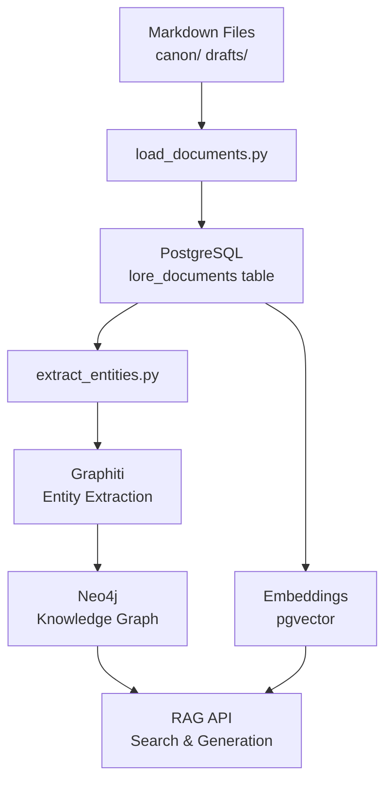

# Pipeline System

**Version**: 0.7.12
**Status**: Production Ready
**Last Updated**: 2025-11-12

A simplified, robust ingestion pipeline for the Luminari lore repository that processes markdown files from organized directories (`canon/` and `drafts/`) into a hybrid Graph RAG system.

---

## Table of Contents

- [Quick Start](#quick-start)
- [System Overview](#system-overview)
- [Pipeline Architecture](#pipeline-architecture)
- [Data Flow](#data-flow)
- [Database Schema](#database-schema)
- [Processing Operations](#processing-operations)
- [Monitoring & Troubleshooting](#monitoring--troubleshooting)
- [Maintenance & Recovery](#maintenance--recovery)
- [Advanced Operations](#advanced-operations)

---

## Quick Start

```bash
# Process canon documents (recommended)
make pipeline-canon

# Process draft documents
make pipeline-draft

# Process all documents
make pipeline-all

# Resume interrupted processing
make resume

# For detailed output, add VERBOSE=1
make pipeline-canon VERBOSE=1
```

---

## System Overview

The pipeline consists of three main stages:

1. **Document Loading** (`load_documents.py`)
   - Scans `canon/` and/or `drafts/` directories
   - Loads all `.md` files (no filtering needed)
   - Tracks changes via content hashing
   - Stores in PostgreSQL with metadata

2. **Entity Extraction** (`extract_entities.py`)
   - Processes documents with pending `graphiti_status`
   - Uses Graphiti to extract entities and relationships
   - Chunks large documents intelligently
   - Stores knowledge graph in Neo4j

3. **Supporting Processes**
   - Episode creation and embedding generation
   - Incremental processing and resume capability
   - Status tracking and error handling

### Architecture Diagram



---

## Pipeline Architecture

### Key Features

#### Simplified Design

- **No file filtering**: Trust the directory structure - `canon/` and `drafts/` contain only lore files
- **No priorities**: All documents are processed equally
- **Dynamic document types**: Based on directory structure (`world`, `cultures`, `factions`, etc.)

#### Robust Processing

- **Incremental updates**: Only processes new/changed documents
- **Restartable**: Use `make resume` to continue after interruption
- **Error recovery**: Failed documents can be retried on next run
- **Change detection**: Content hashing prevents unnecessary reprocessing

#### Clean Output

- **Default mode**: Clean progress bars and summaries
- **Verbose mode**: Add `VERBOSE=1` for detailed debug output including LLM prompts
- **Rich UI**: Uses Rich library for beautiful terminal output

### Directory Structure

The pipeline expects this repository structure:

```
lore/
├── canon/              # Approved lore (empty initially)
│   ├── world/
│   ├── cultures/
│   ├── factions/
│   ├── characters/
│   ├── timeline/
│   └── locations/
├── drafts/             # Draft lore content
│   ├── world/
│   ├── cultures/
│   ├── factions/
│   ├── characters/
│   ├── timeline/
│   ├── locations/
│   └── uncategorized/
└── meta/               # Project metadata (skipped)
```

### Document Types

Documents are automatically categorized by directory:

| Directory        | Document Type |
| ---------------- | ------------- |
| `world/`         | worldbuilding |
| `cultures/`      | culture       |
| `factions/`      | faction       |
| `characters/`    | character     |
| `timeline/`      | chronicle     |
| `locations/`     | location      |
| `uncategorized/` | misc          |
| _(other)_        | lore          |

---

## Data Flow

### 1. Document Ingestion

- **Input**: Markdown files from `canon/` and `drafts/` directories
- **Process**: `load_documents.py` scans directories recursively
- **Output**: Documents stored in PostgreSQL `lore_documents` table
- **Change Detection**: SHA-256 content hashing prevents reprocessing unchanged files

### 2. Entity Extraction

- **Input**: Documents with `graphiti_status = 'pending'`
- **Process**: `extract_entities.py` uses Graphiti for LLM-based extraction
- **Chunking**: Large documents split into overlapping semantic chunks
- **Output**: Entities and relationships in Neo4j knowledge graph

### 3. Embedding Generation

- **Input**: Document content and extracted entities
- **Process**: OpenAI embeddings via `text-embedding-3-small`
- **Output**: Vector embeddings stored in PostgreSQL with pgvector

### 4. RAG Integration

- **Hybrid Search**: Combines vector similarity and graph traversal
- **Context Assembly**: Uses both document content and entity relationships
- **Response Generation**: LLM-powered answers with source attribution

### Content Hashing

Change detection uses SHA-256 hashing:

```python
def calculate_content_hash(self, content: str) -> str:
    return hashlib.sha256(content.encode('utf-8')).hexdigest()
```

When content changes:

- Hash comparison detects changes
- Document status resets to `pending`
- Previous graph entities are updated/replaced

### Chunking Strategy

Large documents are split intelligently:

```python
# Token-based chunking with semantic overlap
chunk_size = min(450, token_count // 2 + 100)
overlap = max(60, int(chunk_size * 0.15))  # 15% overlap minimum
```

This ensures:

- Optimal LLM context usage
- Semantic continuity between chunks
- Efficient entity extraction

---

## Database Schema

### PostgreSQL (`lore_documents`)

```sql
CREATE TABLE lore_documents (
    id UUID PRIMARY KEY,
    stable_id TEXT UNIQUE,
    title TEXT,
    document_type TEXT,
    source_file TEXT UNIQUE,
    body_md TEXT,
    summary TEXT,
    canonical BOOLEAN,
    metadata JSONB,
    graphiti_status TEXT DEFAULT 'pending',
    graphiti_content_hash TEXT,
    graphiti_processed_at TIMESTAMP,
    created_at TIMESTAMP DEFAULT NOW(),
    updated_at TIMESTAMP DEFAULT NOW()
);
```

### Neo4j Schema

Graphiti manages the Neo4j schema automatically with:

- **Entity nodes**: Extracted people, places, concepts, etc.
- **Relationship edges**: Semantic connections between entities
- **Episode nodes**: Links back to source document chunks
- **Community detection**: Hierarchical entity groupings

### Processing States

Documents progress through these states:

1. **`pending`**: New or changed, needs processing
2. **`processing`**: Currently being processed (temporary)
3. **`completed`**: Successfully processed
4. **`failed`**: Processing failed, needs attention

The `make resume` command processes all `pending` and `failed` documents.

### Entity Types

The system recognizes 13 entity types optimized for fantasy lore:

| Type         | Description                | Examples              |
| ------------ | -------------------------- | --------------------- |
| Deity        | Gods and divine beings     | Paladine, Takhisis    |
| Person       | Named individuals          | Sturm Brightblade     |
| Organization | Groups and orders          | Knights of Solamnia   |
| Race         | Species and ethnicities    | Elves, Dwarves        |
| Faction      | Political/military groups  | Dragonarmies          |
| Location     | Places and regions         | Krynn, Palanthas      |
| Creature     | Monsters and beasts        | Dragons, Draconians   |
| Magic        | Spells and magical systems | Wizardry, Clerical    |
| Artifact     | Magical items              | Dragonlances          |
| Event        | Historical occurrences     | War of the Lance      |
| Concept      | Abstract ideas             | Honor, Kingship       |
| Prophecy     | Predictions and omens      | Dragonlance prophecy  |
| Realm        | Planes and dimensions      | Abyss, Mount Celestia |

### Relationship Types

14 semantic relationship types capture fantasy lore connections:

| Type            | Description                  | Usage                   |
| --------------- | ---------------------------- | ----------------------- |
| Commands        | Authority relationships      | Leaders → Organizations |
| ServesUnder     | Service relationships        | Knights → Orders        |
| AlliedWith      | Alliance relationships       | Factions ↔ Factions     |
| OpposedTo       | Conflict relationships       | Good ↔ Evil             |
| Influences      | Influence relationships      | Deities → Mortals       |
| CreatedBy       | Creation relationships       | Artifacts ← Creators    |
| TransformedInto | Change relationships         | Races → New Forms       |
| DescendedFrom   | Heritage relationships       | People ← Ancestors      |
| BoundTo         | Binding relationships        | Souls ↔ Artifacts       |
| Protects        | Protection relationships     | Orders → Locations      |
| Corrupts        | Corruption relationships     | Evil → Good             |
| TeachesTo       | Knowledge relationships      | Masters → Students      |
| Embodies        | Representation relationships | Concepts ↔ Entities     |

---

## Processing Operations

### Basic Pipeline Operations

```bash
make pipeline-canon    # Process canon only (recommended)
make pipeline-draft    # Process drafts only
make pipeline-all      # Process everything

make resume            # Continue interrupted processing
make rebuild           # Full reset + pipeline-canon
```

### Document Loading Only

```bash
make load-canon        # Load canon documents to PostgreSQL
make load-draft        # Load draft documents to PostgreSQL
make load-all          # Load all documents to PostgreSQL
```

### Maintenance Operations

```bash
make status            # Show system status
make clear-graph       # Clear Neo4j (with confirmation)
make reset-all         # Reset all processing flags
```

### Verbose Mode

Add `VERBOSE=1` to any command for detailed output:

```bash
make pipeline-canon VERBOSE=1
make load-all VERBOSE=1
make resume VERBOSE=1
```

#### Verbose Output Includes:

- LLM prompt/response details
- Entity extraction debugging
- Relationship mapping information
- File processing details
- Graph query results
- Error stack traces

---

## Monitoring & Troubleshooting

### Status Monitoring

Check system status:

```bash
make status
```

This shows:

- Document counts by status (pending, completed, failed)
- Neo4j relationship statistics
- Processing errors and warnings

Monitor logs in real-time:

```bash
make logs
```

View container status:

```bash
docker compose -p luminari-sage ps
```

### System Status Output

The `make status` command shows:

```
Document Processing Status:
  Pending: 15
  Completed: 85
  Failed: 3
  Total: 103

Neo4j Statistics:
  Entities: 1,247
  Relationships: 3,891
  Episodes: 892

Recent Errors: 2
```

### Common Issues

#### No Documents Found

```
Found 0 markdown files to process
```

**Causes:**

- `canon/` or `drafts/` directories don't exist
- No `.md` files in target directories
- Wrong source parameter

**Solutions:**

```bash
# Check directory structure
ls -la /home/luminari/lore/

# Verify files exist
find /home/luminari/lore/drafts -name "*.md" | head -10

# Try different source
make load-draft  # if canon is empty
make load-all    # to include both
```

#### Database Connection Errors

```
Failed to connect to PostgreSQL/Neo4j
```

**Solutions:**

```bash
# Check services are running
docker compose -p luminari-sage ps

# Restart services
make restart

# Check container logs
docker compose -p luminari-sage logs postgres
docker compose -p luminari-sage logs neo4j
```

#### OpenAI API Issues

```
OpenAI API key not found / Rate limit exceeded
```

**Solutions:**

```bash
# Check API key is set
docker exec luminari-sage-api-1 python -c \
  "import os; print('OPENAI_API_KEY:', 'SET' if os.getenv('OPENAI_API_KEY') else 'MISSING')"

# If missing, add to docker-compose.yml environment
# Wait for rate limits to reset (usually 1 minute)
```

#### Permission Errors

```
Permission denied accessing files
```

**Solutions:**

```bash
# Check file permissions
ls -la /home/luminari/lore/

# Fix ownership if needed
sudo chown -R $USER:$USER /home/luminari/lore/

# Check Docker volume mounts
docker inspect luminari-sage-api-1 | grep Mounts -A 10
```

### Error Recovery Strategies

#### Partial Processing Failures

When some documents fail but others succeed:

1. Check which documents failed:

   ```bash
   make status
   # Look for documents with 'failed' status
   ```

2. Review error details in logs:

   ```bash
   make logs | grep -A 5 -B 5 "ERROR\|Failed"
   ```

3. Try processing again (often transient issues):

   ```bash
   make resume
   ```

4. For persistent failures, try verbose mode:
   ```bash
   make resume VERBOSE=1
   ```

#### LLM Processing Issues

When Graphiti entity extraction fails:

1. Check for API rate limits:
   - Wait 60 seconds and try again
   - Consider reducing batch size

2. Check for content issues:
   - Very large documents may timeout
   - Malformed markdown may cause issues

3. Reset specific documents:
   ```bash
   # Reset processing status for specific file
   docker exec luminari-sage-api-1 python -c "
   import asyncio
   from src.db import get_postgres_db

   async def reset():
       db = await get_postgres_db()
       await db.execute(
           \"UPDATE lore_documents SET graphiti_status = 'pending' WHERE source_file = %s\",
           'specific/file/path.md'
       )
   asyncio.run(reset())
   "
   ```

---

## Maintenance & Recovery

### Recovery Operations

#### Resume After Interruption

If the pipeline is interrupted (Ctrl+C, system restart, etc.):

```bash
make resume
```

This will:

- Process any documents marked as 'pending' or 'failed'
- Skip already completed documents
- Continue entity extraction for loaded documents

#### Full Reset and Rebuild

For a completely fresh start:

```bash
make rebuild
```

This will:

1. Clear the Neo4j graph
2. Reset all processing flags in PostgreSQL
3. Run the complete pipeline from scratch

#### Partial Resets

Reset just the graph (keep loaded documents):

```bash
make clear-graph
make sync-to-graphiti
```

Reset just the processing flags:

```bash
make reset-all
make sync-to-graphiti
```

Reset just embeddings:

```bash
make reset-embeddings
make generate-embeddings
```

### Regular Maintenance

**Daily** (if actively developing):

- Run `make resume` to process new/changed files
- Check `make status` for any failures

**Weekly**:

- Run full pipeline on significant changes: `make pipeline-all`
- Review logs for recurring errors: `make logs`

**Monthly**:

- Full rebuild for cleanup: `make rebuild`
- Review and clean up old logs

### Performance Optimization

**For faster processing:**

```bash
# Use bulk mode (fewer API calls)
make pipeline-bulk

# Process only specific source
make pipeline-canon  # instead of pipeline-all
```

**For debugging:**

```bash
# Use verbose mode
make pipeline-canon VERBOSE=1

# Process documents individually
make load-canon
make sync-to-graphiti VERBOSE=1
```

### Performance Monitoring

Monitor processing speed:

```bash
# Time a full pipeline run
time make pipeline-canon

# Monitor resource usage
docker stats
```

Track progress in real-time:

```bash
# In one terminal
make pipeline-canon

# In another terminal
watch -n 5 "make status"
```

---

## Advanced Operations

### Performance Considerations

#### Incremental Processing

- Only processes changed documents
- Maintains processing state in database
- Supports interruption and resume

#### Parallel Processing

- Document loading: Sequential (file I/O bound)
- Entity extraction: Sequential (LLM rate limited)
- Embedding generation: Batch processing when possible

#### Memory Management

- Documents processed one at a time
- Large documents chunked to stay within context limits
- Graph connections created incrementally

### Error Handling

#### Document Level

- Individual document failures don't stop pipeline
- Failed documents marked with error status
- Detailed error logging for debugging

#### System Level

- Database connection retries
- LLM API timeout handling
- Graceful shutdown on interruption

#### Recovery

- `make resume` continues from last successful state
- `make rebuild` provides full reset option
- Status tracking enables targeted troubleshooting

### Manual Database Operations

Connect to PostgreSQL:

```bash
docker exec -it luminari-sage-postgres-1 psql -U luminari -d luminari_sage
```

Connect to Neo4j:

```bash
# cypher-shell prompts for credentials interactively
docker exec -it luminari-sage-neo4j-1 cypher-shell
```

### Custom Processing

Process specific documents:

```python
# Custom script example
import asyncio
from scripts.load_documents import DocumentLoader

async def main():
    loader = DocumentLoader("/home/luminari/lore", "canon", verbose=True)
    # Custom processing logic here

if __name__ == "__main__":
    asyncio.run(main())
```

### Backup and Recovery

Backup data:

```bash
# Backup PostgreSQL
docker exec luminari-sage-postgres-1 pg_dump -U luminari luminari_sage > backup.sql

# Backup Neo4j
docker exec luminari-sage-neo4j-1 neo4j-admin database dump neo4j --to-path=/tmp/
docker cp luminari-sage-neo4j-1:/tmp/neo4j.dump ./neo4j-backup.dump
```

Restore data:

```bash
# Restore PostgreSQL
cat backup.sql | docker exec -i luminari-sage-postgres-1 psql -U luminari luminari_sage

# Restore Neo4j (requires stopping service)
docker compose -p luminari-sage stop neo4j
docker exec luminari-sage-neo4j-1 neo4j-admin database load neo4j --from-path=/tmp/
docker compose -p luminari-sage start neo4j
```

---

## Configuration

Key environment variables:

- `OPENAI_API_KEY`: Required for embeddings and entity extraction
- `NEO4J_URI`: Neo4j connection string
- `NEO4J_USER/NEO4J_PASSWORD`: Neo4j authentication
- `POSTGRES_*`: PostgreSQL connection settings

---

## Extensibility

The architecture supports easy extension:

- **New entity types**: Add to `src/graphiti/entity_types.py`
- **New relationships**: Add to `src/graphiti/edge_types.py`
- **Custom processing**: Extend base classes
- **New sources**: Add directory scanning logic

---

## Security

Security considerations:

- API keys managed via environment variables
- Database connections use authentication
- No sensitive data logged in normal mode
- Content hashing prevents data corruption

---

## Integration

The pipeline integrates with:

- **MCP Server**: Provides `/sage/mcp` endpoint for Claude integration
- **API Server**: Provides `/sage/api` endpoints for search and RAG
- **Apache Reverse Proxy**: Routes requests to appropriate services

---

## Related Documentation

- [Architecture Overview](../reference/ARCHITECTURE.md)
- [API Reference](../reference/API_REFERENCE.md)
- [Developer Guide](../development/DEVELOPER_GUIDE.md)
- [Agent System](AGENT_SYSTEM.md)
- [Validation System](VALIDATION_SYSTEM.md)
