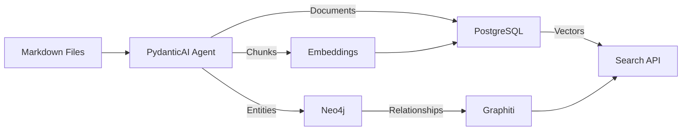

# Luminari Sage Schema Design

## Overview

The new schema design separates concerns between Neo4j (graph relationships) and PostgreSQL (documents/vectors), providing optimal performance for each use case.

## Architecture Decisions

### Why This Split?

1. **Neo4j for Graphs**
   - Native graph traversals (100x faster than SQL joins)
   - Cypher query language designed for relationships
   - Pattern matching and pathfinding algorithms
   - Visual graph exploration tools

2. **PostgreSQL + pgvector for Documents/Vectors**
   - Unified storage reduces complexity
   - ACID transactions for document integrity
   - Excellent full-text search capabilities
   - pgvector performance rivals dedicated vector DBs
   - Single backup/restore process

## Neo4j Schema

### Core Design Principles

- **Node Labels**: Hierarchical (`:Deity:Entity`) for inheritance
- **Properties**: Core attributes on nodes, metadata in `attrs` map
- **Relationships**: Typed and directional with properties
- **Indexes**: Unique constraints on IDs, full-text on searchable fields

### Key Node Types

```cypher
// Entity hierarchy
(:Entity)                    // Base type
  ├── (:Deity:Entity)       // Divine beings
  ├── (:Location:Entity)    // Places
  ├── (:Faction:Entity)     // Organizations
  ├── (:Character:Entity)   // Named individuals
  ├── (:Item:Entity)        // Artifacts/objects
  ├── (:Race:Entity)        // Species/races
  └── (:Concept:Entity)     // Abstract concepts

// Support nodes
(:Event)                     // Timeline events
(:LoreNode)                  // Document references
(:Episode)                   // Graphiti memory
```

### Relationship Patterns

```cypher
// Most important relationships
(:Character)-[:WORSHIPS]->(:Deity)
(:Entity)-[:LOCATED_IN]->(:Location)
(:Character)-[:MEMBER_OF]->(:Faction)
(:Entity)-[:MENTIONED_IN {confidence}]->(:LoreNode)
(:Event)-[:PRECEDED_BY]->(:Event)
```

## PostgreSQL Schema

### Core Tables

1. **lore_documents**: Full markdown documents
   - Stores complete source files
   - Full-text search on title/summary/body
   - Metadata in JSONB for flexibility

2. **chunks**: RAG-optimized text segments
   - ~400 token segments with overlap
   - 384-dimensional embeddings (MiniLM)
   - Entity references link to Neo4j
   - IVFFLAT index for vector similarity

3. **entity_mentions**: Bridges PostgreSQL ↔ Neo4j
   - Maps text spans to entity IDs
   - Tracks confidence scores
   - Enables entity-aware search

4. **validation_results**: Lore consistency tracking
   - Validation status and messages
   - Viability scores (0-100)
   - Resolution tracking

### Key Features

- **Hybrid Search**: Combines vector similarity + full-text
- **Efficient Indexes**: IVFFLAT for vectors, GIN for JSONB/text
- **Flexible Metadata**: JSONB columns for extensibility
- **Built-in Functions**: `search_chunks()`, `hybrid_search()`

## Data Flow



## Migration Strategy

### From Markdown to Knowledge Graph

1. **Document Processing**
   ```python
   # Load markdown → PostgreSQL lore_documents
   document = load_markdown(file_path)
   doc_id = insert_document(document)
   ```

2. **Entity Extraction** (via PydanticAI)
   ```python
   # Extract entities → Neo4j nodes
   entities = await entity_agent.extract(document)
   for entity in entities:
       graphiti.add_entity(entity)
   ```

3. **Chunking & Embedding**
   ```python
   # Create chunks → PostgreSQL chunks table
   chunks = chunker.split(document)
   for chunk in chunks:
       embedding = model.encode(chunk.text)
       insert_chunk(chunk, embedding)
   ```

4. **Relationship Discovery** (via Graphiti)
   ```python
   # Build relationships → Neo4j edges
   relationships = graphiti.extract_relations(document)
   graphiti.add_relationships(relationships)
   ```

## Query Patterns

### Finding Information

1. **Semantic Search** (PostgreSQL)
   ```sql
   SELECT * FROM search_chunks($embedding, 10, 0.7);
   ```

2. **Entity Lookup** (Neo4j)
   ```cypher
   MATCH (e:Entity {name: $name})
   OPTIONAL MATCH (e)-[r]-(connected)
   RETURN e, collect(r) as relationships
   ```

3. **Hybrid RAG Query** (Both)
   ```python
   # Get semantic matches from PostgreSQL
   chunks = pg.search_chunks(query_embedding)
   
   # Expand with graph context from Neo4j
   for chunk in chunks:
       entities = neo4j.get_entities(chunk.entity_refs)
       context = neo4j.get_context(entities, depth=2)
   ```

## Performance Optimizations

### Neo4j
- Unique constraints on `stable_id`
- Composite indexes on frequently queried properties
- Full-text indexes for search
- Relationship indexes for traversal

### PostgreSQL
- IVFFLAT index with tuned list size (100 for chunks)
- GIN indexes on JSONB and full-text
- Partial indexes for canonical content
- Materialized views for statistics

## Scaling Considerations

### Neo4j Scaling
- Start with single instance (sufficient for <10M nodes)
- Causal clustering when needed
- Read replicas for query scaling

### PostgreSQL Scaling
- Partitioning by document date
- Read replicas for vector search
- Connection pooling with pgbouncer
- Consider Citus for sharding if needed

## Best Practices

1. **Always use stable_ids** (ULID/KSUID) for cross-database references
2. **Store embeddings with chunks** to avoid recomputation
3. **Track confidence scores** for entity mentions
4. **Use canonical flags** to distinguish authoritative content
5. **Maintain bidirectional references** between databases
6. **Version your schema migrations** for rollback capability

## Monitoring Queries

### Neo4j Health
```cypher
// Count nodes by label
MATCH (n) RETURN labels(n), count(*);

// Find orphaned entities
MATCH (e:Entity) WHERE NOT (e)-[:MENTIONED_IN]-() RETURN e;
```

### PostgreSQL Health
```sql
-- Check embedding coverage
SELECT COUNT(*) filter (WHERE embedding IS NULL) as missing,
       COUNT(*) filter (WHERE embedding IS NOT NULL) as indexed
FROM chunks;

-- Find validation issues
SELECT status, COUNT(*) FROM validation_results 
GROUP BY status;
```

## Future Enhancements

1. **Graph Embeddings**: Add node2vec for entity embeddings
2. **Temporal Queries**: Time-travel through lore versions
3. **Collaborative Filtering**: Learn from search patterns
4. **Auto-consolidation**: Merge duplicate entities
5. **Multi-modal**: Support images/maps in lore